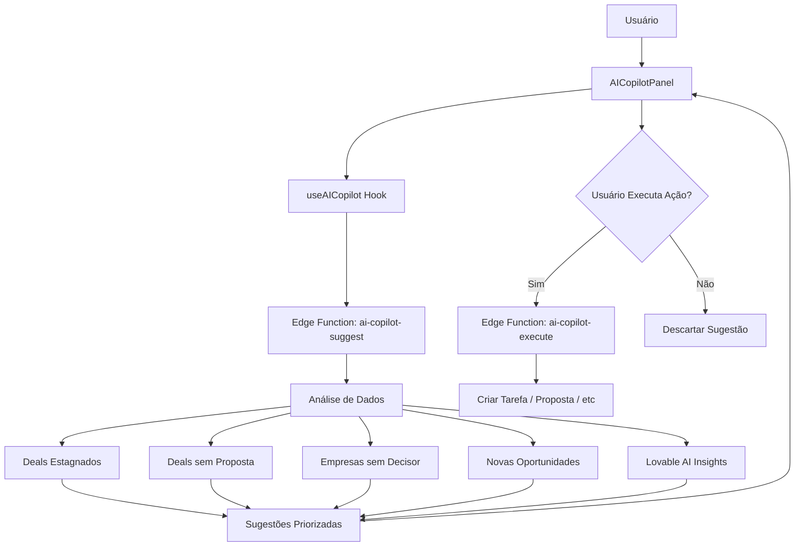

# Sistema AI Copilot - Assistente Inteligente de Vendas

## 📋 Visão Geral

O **AI Copilot** é um assistente inteligente que monitora continuamente o estado do CRM e gera **sugestões contextuais, alertas e ações** para guiar SDRs e vendedores através do fluxo de vendas completo.

---

## 🎯 Objetivo

Transformar dados passivos em **ações ativas** através de:
1. **Monitoramento contínuo** de deals, empresas e atividades
2. **Análise inteligente** com IA para identificar oportunidades
3. **Sugestões acionáveis** com botões de ação direta
4. **Alertas proativos** sobre riscos e oportunidades

---

## 🏗️ Arquitetura



---

## 📦 Componentes

### 1. **Frontend**

#### `AICopilotPanel` 
Painel flutuante no canto inferior direito que exibe sugestões em tempo real.

**Features:**
- ✅ Minimizável com badge de notificações
- ✅ Lista de sugestões priorizadas
- ✅ Ações com um clique
- ✅ Descarte de sugestões
- ✅ Indicador de confiança (confidence score)

#### `useAICopilot` Hook
Hook React Query que:
- Busca sugestões a cada 1 minuto
- Executa ações sugeridas
- Descarta sugestões
- Obtém insights de deals específicos

**Uso:**
```typescript
const { suggestions, executeSuggestion, dismissSuggestion } = useCopilotAlerts();
```

---

### 2. **Backend**

#### Edge Function: `ai-copilot-suggest`
**Responsabilidades:**
1. Analisar deals estagnados (>7 dias sem atividade)
2. Identificar deals com alta probabilidade sem proposta
3. Detectar deals sem decisor mapeado
4. Encontrar empresas recentemente enriquecidas sem deal
5. Analisar contexto do deal ativo
6. Gerar insights com Lovable AI

**Output:**
```typescript
{
  suggestions: [
    {
      id: "stale-deal-123",
      type: "alert",
      priority: "urgent",
      title: "Deal parado há 15 dias",
      description: "Prospecção - Acme Corp não tem atividade há 15 dias...",
      action: {
        label: "Agendar Follow-up",
        type: "create_task",
        payload: { dealId: "123", taskType: "follow_up" }
      },
      metadata: {
        dealId: "123",
        confidence: 0.95
      }
    }
  ]
}
```

#### Edge Function: `ai-copilot-execute`
Executa ações sugeridas:
- `create_task`: Criar tarefa no SDR
- `create_proposal`: Iniciar proposta comercial
- `update_deal`: Atualizar campos do deal
- `send_message`: Criar rascunho de mensagem
- `navigate`: Navegação (tratada no frontend)

---

## 🤖 Tipos de Sugestões

### 1. **Alertas (alert)**
**Prioridade:** Urgent/High  
**Gatilhos:**
- Deal estagnado >7 dias
- SLA de resposta excedido
- Risco de perda de deal

**Ação típica:** Agendar follow-up

---

### 2. **Oportunidades (opportunity)**
**Prioridade:** High/Medium  
**Gatilhos:**
- Deal com prob. >70% sem proposta
- Empresa enriquecida recentemente
- Sinal de compra detectado

**Ação típica:** Criar proposta / Criar deal

---

### 3. **Avisos (warning)**
**Prioridade:** High/Medium  
**Gatilhos:**
- Deal muito tempo no mesmo estágio (>30 dias)
- Probabilidade baixa em estágio avançado
- Dados incompletos críticos

**Ação típica:** Revisar qualificação / Atualizar dados

---

### 4. **Ações (action)**
**Prioridade:** Medium  
**Gatilhos:**
- Próximo passo sugerido por IA
- Necessidade de mapear decisor
- Atualização de dados

**Ação típica:** Buscar decisores / Atualizar empresa

---

### 5. **Insights (insight)**
**Prioridade:** Medium/Low  
**Gatilhos:**
- Análise de IA contextual
- Padrões detectados
- Recomendações estratégicas

**Ação típica:** Visualizar análise / Ler recomendação

---

## 🧠 Integração com Lovable AI

O Copilot usa **Lovable AI** (Gemini 2.5 Flash) para gerar insights contextuais quando:
- Há menos de 5 sugestões baseadas em regras
- Contexto do usuário é complexo
- Necessário raciocínio estratégico

**Prompt enviado:**
```
Contexto do vendedor:
- Página atual: /sdr/workspace
- Deals estagnados: 3
- Deals sem proposta: 2
- Deal ativo: { stage: "demo", probability: 75, daysInStage: 12 }

Sugira 1-2 ações estratégicas que o vendedor deve tomar AGORA.
```

**Resposta esperada:**
```
1. Envie proposta para o deal ativo - com 75% de prob. e 12 dias no estágio demo, é hora de avançar.
2. Faça follow-up nos 3 deals estagnados hoje - risco de perder momentum.
```

---

## 📊 Fluxo de Uso Real

### Cenário 1: SDR chega ao sistema
1. **Copilot detecta:** 2 deals estagnados há 10 dias
2. **Sugestão gerada:** 
   - Tipo: `alert`
   - Prioridade: `high`
   - Ação: "Agendar Follow-up"
3. **SDR clica:** Tarefa criada automaticamente para hoje
4. **Resultado:** Deal volta ao radar ativo

---

### Cenário 2: Deal em estágio "Demo" com prob. 80%
1. **Copilot detecta:** Alta probabilidade mas sem proposta
2. **Sugestão gerada:**
   - Tipo: `opportunity`
   - Prioridade: `high`
   - Ação: "Criar Proposta"
3. **Vendedor clica:** Proposta draft criada e vinculada ao deal
4. **Resultado:** Deal avança para "Proposal"

---

### Cenário 3: Empresa enriquecida com score 85
1. **Copilot detecta:** Nova empresa sem deal
2. **Sugestão gerada:**
   - Tipo: `opportunity`
   - Prioridade: `high`
   - Ação: "Criar Deal"
3. **SDR clica:** Navegado para workspace com pré-seleção
4. **Resultado:** Novo deal criado em "Discovery"

---

### Cenário 4: Deal travado há 35 dias em "Qualification"
1. **Copilot detecta:** Muito tempo no mesmo estágio
2. **Lovable AI analisa:** "Deal pode estar mal qualificado ou faltam dados"
3. **Sugestão gerada:**
   - Tipo: `warning`
   - Prioridade: `high`
   - Ação: "Revisar Qualificação"
4. **Vendedor clica:** Abre deal para análise detalhada
5. **Resultado:** Vendedor identifica objeção não mapeada

---

## 🎨 UI/UX

### Estados do Painel

**1. Minimizado:**
- Ícone Sparkles com badge de contador
- 64x64px no canto inferior direito
- Clique para expandir

**2. Expandido:**
- Largura: 384px
- Altura máxima: 600px
- Scroll interno
- Lista de sugestões priorizadas

**3. Vazio (sem sugestões):**
```
✨ Sparkles icon
Tudo certo por aqui! 🎉
O Copilot está monitorando suas atividades
```

---

### Card de Sugestão

```
[Icon] Deal parado há 15 dias                    [urgent]

Prospecção - Acme Corp não tem atividade há 15
dias. Risco de perder oportunidade.

Confiança: ████████████░░░░░░░░ 95%

[Agendar Follow-up >]  [Descartar]
```

**Elementos:**
- Ícone contextual (Alerta/TrendingUp/Zap/Lightbulb)
- Badge de prioridade (urgent/high/medium/low)
- Título conciso
- Descrição clara
- Barra de confiança
- Botões de ação

---

## 🔄 Atualização e Performance

### Frequência de Atualização
- **Polling:** A cada 1 minuto (React Query `refetchInterval`)
- **Manual:** Ao navegar entre páginas
- **Evento:** Após executar/descartar sugestão

### Otimizações
1. **Cache:** React Query mantém cache de 5 minutos
2. **Dedupe:** Requests duplicados são unificados
3. **Background:** Atualização em background sem bloquear UI
4. **Lazy Load:** Painel só renderiza quando expandido

---

## 📈 Métricas e Monitoramento

### KPIs do Copilot
```sql
-- Taxa de aceitação de sugestões
SELECT 
  COUNT(*) FILTER (WHERE action_executed) * 100.0 / COUNT(*) as acceptance_rate
FROM copilot_suggestion_events;

-- Tipos de sugestão mais efetivos
SELECT 
  suggestion_type,
  COUNT(*) FILTER (WHERE action_executed) as accepted,
  COUNT(*) as total
FROM copilot_suggestion_events
GROUP BY suggestion_type;

-- Tempo médio até ação
SELECT 
  AVG(EXTRACT(EPOCH FROM (executed_at - created_at)) / 60) as avg_minutes_to_action
FROM copilot_suggestion_events
WHERE action_executed = true;
```

---

## 🚀 Evolução Futura

### Fase 2: Aprendizado de Máquina
- [ ] Treinar modelo com histórico de aceitação/rejeição
- [ ] Personalizar sugestões por vendedor
- [ ] Prever probabilidade de fechamento

### Fase 3: Automação Avançada
- [ ] Auto-execução de ações de baixo risco
- [ ] Sequências de ações encadeadas
- [ ] Integração com calendário (agendar reuniões)

### Fase 4: Análise Preditiva
- [ ] Prever churn de deals
- [ ] Identificar padrões de sucesso
- [ ] Recomendar estratégias de negociação

---

## 🛠️ Manutenção

### Adicionar Novo Tipo de Sugestão

1. **Backend** (`ai-copilot-suggest`):
```typescript
// Adicionar lógica de detecção
const { data: newPattern } = await supabase
  .from('table')
  .select('*')
  .filter(...);

if (newPattern) {
  suggestions.push({
    id: `new-pattern-${id}`,
    type: 'new_type',
    priority: 'medium',
    title: '...',
    description: '...',
    action: { ... }
  });
}
```

2. **Frontend** (`AICopilotPanel`):
```typescript
// Adicionar ícone
const ICON_MAP = {
  ...existing,
  new_type: NewIcon
};
```

3. **Executor** (`ai-copilot-execute`):
```typescript
case 'new_action_type':
  // Implementar lógica
  break;
```

---

## 📚 Referências

- Hook: `src/hooks/useAICopilot.ts`
- Componente: `src/components/copilot/AICopilotPanel.tsx`
- Edge Functions: 
  - `supabase/functions/ai-copilot-suggest/index.ts`
  - `supabase/functions/ai-copilot-execute/index.ts`
- Documentação: `docs/AI_COPILOT_SISTEMA.md`

---

## 🎯 Resumo

O **AI Copilot** transforma o CRM de reativo em **proativo**, guiando vendedores através de:
1. ✅ Detecção automática de riscos e oportunidades
2. ✅ Sugestões acionáveis com um clique
3. ✅ Análise contextual com IA
4. ✅ Priorização inteligente de ações
5. ✅ Monitoramento contínuo do pipeline

**Resultado:** Vendedores sempre sabem o que fazer, quando fazer e por quê.
