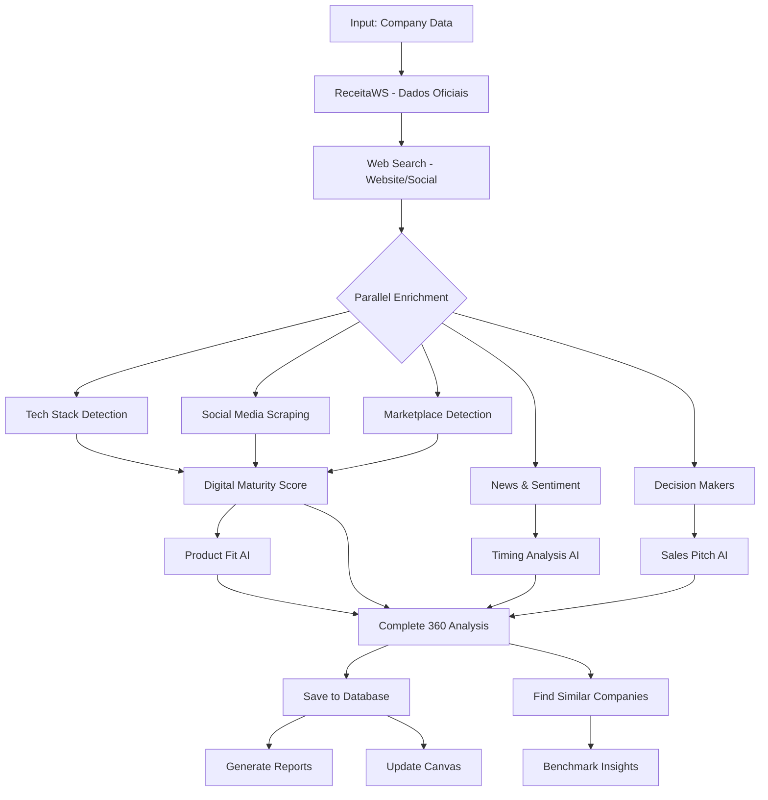

# Arquitetura de Inteligência 360º - Sales Intelligence Platform

## 1. VISÃO GERAL

Sistema de inteligência de vendas que integra múltiplas fontes de dados para gerar análises preditivas, identificar fits de produtos TOTVS, gerar pitches personalizados e identificar empresas similares.

### Objetivo Principal
Fornecer visão 360º de empresas B2B para vendas consultivas de produtos/serviços TOTVS com base em:
- Maturidade digital real
- Momento da empresa (timing)
- Sinais de compra
- Perfil de decisores
- Presença digital e marketplace
- Benchmarking setorial

---

## 2. PRODUTOS TOTVS (Catálogo de Soluções)

### 2.1 Produtos Core (POPULARES)
```typescript
const TOTVS_PRODUCTS = {
  // Core Products
  ERP: {
    name: "Sistema de Gestão (ERP)",
    description: "ERP completo para transformar a gestão do negócio",
    fit_indicators: ["baixa_maturidade_sistemas", "processos_manuais", "crescimento_rápido"],
    target_sectors: ["todos"],
    ticket_range: "alto"
  },
  
  FLUIG: {
    name: "Fluig - Workflow & BPM",
    description: "Automatize workflows e transforme gestão de processos",
    fit_indicators: ["processos_manuais", "baixa_automação", "documentação_física"],
    target_sectors: ["todos"],
    ticket_range: "médio"
  },
  
  IPAAS: {
    name: "iPaaS - Integração",
    description: "Integração inteligente de sistemas e dados",
    fit_indicators: ["múltiplos_sistemas", "silos_de_dados", "integrações_complexas"],
    target_sectors: ["todos"],
    ticket_range: "médio-alto"
  },

  // Sales & Marketing
  CRM: {
    name: "CRM / Automação",
    description: "Acelere vendas com inteligência e automação",
    fit_indicators: ["equipe_vendas_grande", "processo_vendas_complexo", "baixo_controle_pipeline"],
    target_sectors: ["distribuição", "manufatura", "serviços"],
    ticket_range: "médio"
  },
  
  SFA: {
    name: "SFA - Sales Force Automation",
    description: "Automação da força de vendas em campo",
    fit_indicators: ["equipe_campo", "vendas_externas", "distribuidores"],
    target_sectors: ["distribuição", "agro", "manufatura"],
    ticket_range: "médio"
  },
  
  MARKETING_DIGITAL: {
    name: "Marketing Digital",
    description: "Estratégias digitais para atrair e converter",
    fit_indicators: ["baixa_presença_digital", "sem_estratégia_digital", "b2c_component"],
    target_sectors: ["todos"],
    ticket_range: "baixo-médio"
  },

  // Financial
  TECHFIN: {
    name: "Techfin",
    description: "Soluções financeiras digitais para seu negócio",
    fit_indicators: ["gestão_financeira_complexa", "múltiplas_moedas", "crédito"],
    target_sectors: ["financial_services", "distribuição"],
    ticket_range: "alto"
  },
  
  CREDITO: {
    name: "Crédito",
    description: "Análise, concessão e recuperação de crédito",
    fit_indicators: ["concessão_crédito", "inadimplência_alta", "vendas_prazo"],
    target_sectors: ["distribuição", "financial_services"],
    ticket_range: "médio"
  },
  
  PAGAMENTOS: {
    name: "Pagamentos",
    description: "Processos de pagamento simplificados e seguros",
    fit_indicators: ["múltiplos_meios_pagamento", "ecommerce", "marketplace"],
    target_sectors: ["todos"],
    ticket_range: "baixo-médio"
  },

  // Analytics & Intelligence
  ANALYTICS: {
    name: "Analytics & BI",
    description: "Inteligência de dados para decisões estratégicas",
    fit_indicators: ["decisões_sem_dados", "múltiplas_fontes_dados", "necessidade_dashboards"],
    target_sectors: ["todos"],
    ticket_range: "médio"
  },
  
  IA: {
    name: "Inteligência Artificial",
    description: "IA aplicada para automação e insights",
    fit_indicators: ["alta_maturidade_digital", "grande_volume_dados", "processos_repetitivos"],
    target_sectors: ["todos"],
    ticket_range: "alto"
  },

  // People & Operations
  RH: {
    name: "RH - Gestão de Pessoas",
    description: "Plataforma completa para gestão de pessoas",
    fit_indicators: ["muitos_funcionários", "alta_rotatividade", "processos_rh_manuais"],
    target_sectors: ["todos"],
    ticket_range: "médio"
  },
  
  ATENDIMENTO_CHATBOT: {
    name: "Atendimento e Chatbot",
    description: "Automação de atendimento com IA",
    fit_indicators: ["alto_volume_atendimento", "sac", "suporte_técnico"],
    target_sectors: ["todos"],
    ticket_range: "baixo-médio"
  },

  // Infrastructure
  CLOUD: {
    name: "Cloud",
    description: "Infraestrutura cloud segura e escalável",
    fit_indicators: ["infraestrutura_própria", "custos_ti_altos", "escalabilidade"],
    target_sectors: ["todos"],
    ticket_range: "médio-alto"
  },
  
  ASSINATURA_ELETRONICA: {
    name: "Assinatura Eletrônica",
    description: "Documentos assinados de forma segura e legal",
    fit_indicators: ["alto_volume_contratos", "processos_legais", "documentação_física"],
    target_sectors: ["todos"],
    ticket_range: "baixo"
  }
};
```

### 2.2 Setores Verticais
```typescript
const TOTVS_SECTORS = {
  AGRO: {
    name: "Agro",
    key_products: ["ERP", "SFA", "ANALYTICS", "CLOUD"],
    specific_needs: ["rastreabilidade", "safra", "gestão_rural", "commodities"]
  },
  
  CONSTRUCAO: {
    name: "Construção",
    key_products: ["ERP", "FLUIG", "RH", "ANALYTICS"],
    specific_needs: ["gestão_obras", "orçamentos", "cronogramas", "medições"]
  },
  
  DISTRIBUICAO: {
    name: "Distribuição",
    key_products: ["ERP", "SFA", "CRM", "CREDITO", "ANALYTICS"],
    specific_needs: ["gestão_estoque", "logística", "rotas", "vendedores_externos"]
  },
  
  FINANCIAL_SERVICES: {
    name: "Financial Services",
    key_products: ["TECHFIN", "CREDITO", "PAGAMENTOS", "IA", "ANALYTICS"],
    specific_needs: ["compliance", "risco", "crédito", "open_banking"]
  },
  
  LOGISTICA: {
    name: "Logística",
    key_products: ["ERP", "FLUIG", "ANALYTICS", "CLOUD"],
    specific_needs: ["rastreamento", "tms", "armazenagem", "last_mile"]
  },
  
  MANUFATURA: {
    name: "Manufatura",
    key_products: ["ERP", "FLUIG", "ANALYTICS", "IPAAS", "RH"],
    specific_needs: ["pcp", "qualidade", "manutenção", "chão_fábrica"]
  },
  
  PRESTADORES_SERVICOS: {
    name: "Prestadores de Serviços",
    key_products: ["ERP", "CRM", "FLUIG", "RH", "ASSINATURA_ELETRONICA"],
    specific_needs: ["gestão_projetos", "timesheet", "contratos", "faturamento"]
  }
};
```

---

## 3. INPUT ENRIQUECIDO DE EMPRESA

### 3.1 Campos de Identificação Múltipla
```typescript
interface EnhancedCompanyInput {
  // Identificação Oficial
  cnpj?: string;
  razao_social?: string;
  
  // Identificação Comercial
  nome_fantasia?: string;
  marca_principal?: string;
  website?: string;
  domain?: string;
  
  // Redes Sociais
  social_handles: {
    linkedin_company?: string;      // /company/nome-empresa
    linkedin_url?: string;           // URL completa
    instagram_handle?: string;       // @empresa
    facebook_handle?: string;        // @empresa ou /empresa
    twitter_handle?: string;         // @empresa
    youtube_channel?: string;        // @empresa
  };
  
  // Marketplace Presence (opcional - será detectado automaticamente)
  marketplace_presence?: {
    alibaba?: string;
    b2b_brasil?: string;
    mercado_livre?: string;
    canal_rural?: string;
    b21?: string;
    outros?: string[];
  };
  
  // Setores e Tags
  cnae?: string;
  setor_vertical?: keyof typeof TOTVS_SECTORS;
  tags?: string[];
}
```

### 3.2 Fluxo de Busca Inteligente
```
1. CNPJ → ReceitaWS → Dados oficiais (razão social, CNAE, endereço)
2. Razão Social / Nome Fantasia → Web Search → Website, Social Media
3. Website/Domain → Tech Stack Detection
4. Social Handles → Scraping de perfis (LinkedIn, Instagram, etc.)
5. Marca + Setor → Marketplace Detection
6. LinkedIn Company → Decision Makers scraping
7. Todas as fontes → News & Sentiment Analysis
```

---

## 4. ENGINES DE INTELIGÊNCIA

### 4.1 Digital Presence Engine (Expandido)

**Objetivo**: Mapear presença digital completa da empresa

**Fontes de Dados**:
```typescript
interface DigitalPresenceSources {
  // Websites & Tech
  website_analysis: {
    tech_stack: string[];           // Detectado via APIs
    performance_score: number;       // Google PageSpeed, etc.
    seo_score: number;
    mobile_friendly: boolean;
    has_ecommerce: boolean;
  };
  
  // Social Media
  social_media: {
    linkedin: LinkedInCompanyData;   // PhantomBuster
    instagram: InstagramData;        // Scraping
    facebook: FacebookData;          // Scraping
    twitter: TwitterData;            // API ou scraping
    youtube: YouTubeData;            // API
  };
  
  // Marketplaces
  marketplace_presence: {
    alibaba: MarketplaceData;
    b2b_brasil: MarketplaceData;
    mercado_livre: MarketplaceData;
    canal_rural: MarketplaceData;
    b21: MarketplaceData;
  };
  
  // News & Media
  news_mentions: {
    articles: NewsArticle[];         // Google News API ou Serper
    sentiment_score: number;         // AI Analysis
    key_topics: string[];
    recent_events: Event[];
  };
}
```

**Scoring Consolidado**:
```typescript
interface DigitalPresenceScore {
  overall_score: number;              // 0-100
  
  breakdown: {
    website_score: number;            // 0-100
    social_media_score: number;       // 0-100
    marketplace_score: number;        // 0-100
    content_score: number;            // 0-100 (frequência de posts)
    engagement_score: number;         // 0-100 (likes, comments, shares)
    reputation_score: number;         // 0-100 (sentiment analysis)
  };
  
  classification: "Excelente" | "Boa" | "Média" | "Baixa" | "Muito Baixa";
}
```

### 4.2 Company Timing & Momentum Engine

**Objetivo**: Identificar o momento ideal para abordagem de vendas

**Sinais de Timing**:
```typescript
interface TimingSignals {
  // Crescimento
  growth_signals: {
    hiring_spree: boolean;             // LinkedIn - vagas abertas
    new_locations: boolean;            // Notícias de expansão
    funding_round: boolean;            // Notícias de investimento
    revenue_growth: boolean;           // Dados financeiros
  };
  
  // Mudanças Organizacionais
  organizational_changes: {
    new_c_level: boolean;              // Novo CEO, CTO, CFO
    restructuring: boolean;            // Reestruturação organizacional
    merger_acquisition: boolean;       // M&A
  };
  
  // Sinais Digitais
  digital_signals: {
    new_website: boolean;              // Website novo/reformulado
    new_products: boolean;             // Lançamento de produtos
    social_media_spike: boolean;       // Aumento atividade redes
    job_postings_tech: boolean;        // Vagas de TI/Digital
  };
  
  // Sinais de Dor
  pain_signals: {
    negative_reviews: boolean;         // Reviews negativas
    operational_issues: boolean;       // Notícias de problemas
    compliance_issues: boolean;        // Problemas regulatórios
    tech_debt: boolean;                // Tech stack desatualizado
  };
  
  timing_score: number;                // 0-100 (quanto maior, melhor o timing)
  recommended_approach: "Imediata" | "Curto Prazo" | "Médio Prazo" | "Monitorar";
}
```

### 4.3 Product Fit Engine (TOTVS-Specific)

**Objetivo**: Recomendar produtos TOTVS mais adequados

**Algoritmo de Fit**:
```typescript
interface ProductFitAnalysis {
  company_profile: {
    sector: string;
    size: "micro" | "pequena" | "média" | "grande";
    digital_maturity: number;         // 0-100
    tech_stack: string[];
    pain_points: string[];
    growth_stage: "startup" | "crescimento" | "consolidada" | "enterprise";
  };
  
  recommended_products: Array<{
    product: keyof typeof TOTVS_PRODUCTS;
    fit_score: number;                // 0-100
    priority: "alta" | "média" | "baixa";
    reasoning: string[];              // Por que recomendamos
    expected_roi: string;
    implementation_complexity: "baixa" | "média" | "alta";
    ticket_estimate: string;
  }>;
  
  product_bundle: {
    name: string;                     // Ex: "Pacote Transformação Digital"
    products: string[];
    total_fit_score: number;
    bundle_reasoning: string;
  };
  
  // Baseado em empresas similares
  benchmark: {
    similar_companies_using: Array<{
      product: string;
      adoption_rate: number;          // % de empresas similares que usam
    }>;
  };
}
```

### 4.4 Decision Makers Intelligence Engine

**Objetivo**: Identificar e perfilar tomadores de decisão

**Fontes**:
- LinkedIn Company Page → Employees
- Apollo.io → Contacts by title
- News mentions → Executives in news

**Output**:
```typescript
interface DecisionMakerProfile {
  // Dados Básicos
  name: string;
  title: string;
  department: "TI" | "Operações" | "Financeiro" | "C-Level" | "Vendas" | "RH";
  seniority: "C-Level" | "VP" | "Diretor" | "Gerente" | "Coordenador";
  
  // Contato
  email?: string;
  verified_email: boolean;
  linkedin_url: string;
  phone?: string;
  
  // Perfil & Influência
  decision_power: "Alto" | "Médio" | "Baixo";
  budget_authority: boolean;
  tech_savvy: boolean;                // Based on LinkedIn skills/posts
  influence_score: number;            // 0-100
  
  // Contexto
  tenure: number;                     // Meses na empresa
  recent_posts: LinkedInPost[];       // Últimos posts no LinkedIn
  interests: string[];                // Topics of interest
  
  // Abordagem Recomendada
  recommended_approach: {
    channel: "LinkedIn" | "Email" | "Phone" | "Event";
    timing: string;
    talking_points: string[];
    personalization_tips: string[];
  };
}
```

### 4.5 AI Insights Generator Engine

**Objetivo**: Gerar insights acionáveis via IA (Lovable AI)

**Prompts Estruturados**:

```typescript
// Prompt para Análise de Momento
const TIMING_ANALYSIS_PROMPT = `
Você é um analista de inteligência de vendas B2B especializado em TOTVS.

Analise os dados da empresa abaixo e identifique:
1. Momento atual da empresa (crescimento, estabilidade, crise, transformação)
2. Janela de oportunidade para abordagem de vendas
3. Principais dores e necessidades
4. Eventos recentes relevantes
5. Recomendações de timing para abordagem

Dados da empresa:
- Nome: {company_name}
- Setor: {sector}
- Maturidade Digital: {digital_maturity}
- Notícias Recentes: {recent_news}
- Atividade nas Redes: {social_activity}
- Sinais de Compra: {buying_signals}
- Mudanças Organizacionais: {org_changes}

Retorne uma análise estruturada em JSON com:
{
  "momento_empresa": "...",
  "janela_oportunidade": "...",
  "dores_identificadas": [...],
  "eventos_relevantes": [...],
  "timing_score": 0-100,
  "recomendacao_abordagem": "...",
  "urgencia": "alta|média|baixa"
}
`;

// Prompt para Product Fit
const PRODUCT_FIT_PROMPT = `
Você é um especialista em soluções TOTVS.

Analise o perfil da empresa e recomende os produtos TOTVS mais adequados:

Perfil da Empresa:
- Setor: {sector}
- Porte: {size}
- Maturidade Digital: {digital_maturity}/100
- Tech Stack Atual: {tech_stack}
- Dores Identificadas: {pain_points}
- Orçamento Estimado: {budget_range}

Produtos TOTVS Disponíveis:
{TOTVS_PRODUCTS_CATALOG}

Retorne em JSON:
{
  "produtos_recomendados": [
    {
      "produto": "...",
      "fit_score": 0-100,
      "reasoning": "...",
      "roi_esperado": "...",
      "prioridade": "alta|média|baixa"
    }
  ],
  "bundle_sugerido": "...",
  "sequencia_implementacao": [...]
}
`;

// Prompt para Sales Pitch
const SALES_PITCH_PROMPT = `
Você é um especialista em vendas consultivas B2B.

Crie um pitch de vendas personalizado para a empresa baseado nos dados:

Empresa: {company_name}
Setor: {sector}
Decisor: {decision_maker_name} - {decision_maker_title}
Momento da Empresa: {timing_analysis}
Produtos Recomendados: {recommended_products}
Dores Identificadas: {pain_points}

Crie um pitch que inclua:
1. Hook inicial personalizado (referenciando algo específico da empresa)
2. Identificação das dores
3. Solução TOTVS específica
4. Valor agregado da consultoria OLV
5. Call-to-action
6. Sugestão de primeiro passo

Retorne em JSON:
{
  "subject_line": "...",
  "opening": "...",
  "pain_acknowledgment": "...",
  "solution_presentation": "...",
  "value_proposition": "...",
  "social_proof": "...",
  "call_to_action": "...",
  "recommended_next_step": "..."
}
`;
```

### 4.6 Similar Companies Engine (Vendor Matching)

**Objetivo**: Encontrar empresas similares para benchmarking e prospecção

**Critérios de Similaridade**:
```typescript
interface SimilaritySearch {
  search_criteria: {
    cnae?: string;                    // Mesmo CNAE
    sector?: string;                  // Mesmo setor vertical
    size_range?: string;              // Faixa de funcionários similar
    location?: string;                // Mesma região/estado
    products?: string[];              // Produtos similares
    tech_stack?: string[];            // Tecnologias similares
    digital_maturity_range?: number; // Faixa de maturidade similar
  };
  
  search_sources: {
    internal_database: boolean;       // Empresas já analisadas
    web_search: boolean;              // Busca na web
    linkedin: boolean;                // LinkedIn similar companies
    marketplace: boolean;             // Mesmos marketplaces
  };
  
  results: Array<{
    company: Company;
    similarity_score: number;         // 0-100
    similarity_factors: string[];     // O que as torna similares
    totvs_adoption?: {                // Se já usa TOTVS
      products: string[];
      satisfaction_score?: number;
    };
  }>;
}
```

---

## 5. ORQUESTRAÇÃO - EDGE FUNCTIONS

### 5.1 Função Principal: `enrich-company-360`

```typescript
// supabase/functions/enrich-company-360/index.ts
/**
 * Orquestra todo o processo de enriquecimento 360º
 * 
 * Input: EnhancedCompanyInput
 * Output: Complete360Analysis
 */

async function enrichCompany360(input: EnhancedCompanyInput) {
  // 1. Busca dados oficiais (CNPJ)
  const officialData = await fetchReceitaWS(input.cnpj);
  
  // 2. Busca website e domínio
  const webData = await fetchWebsiteData(input.website || officialData.website);
  
  // 3. Tech Stack Detection
  const techStack = await detectTechStack(input.domain);
  
  // 4. Digital Presence (paralelo)
  const [socialMedia, marketplace, news] = await Promise.all([
    fetchSocialMediaData(input.social_handles),
    detectMarketplacePresence(input.marca_principal, input.domain),
    fetchNewsAndSentiment(input.razao_social, input.nome_fantasia)
  ]);
  
  // 5. Decision Makers (LinkedIn + Apollo)
  const decisionMakers = await fetchDecisionMakers(
    input.social_handles.linkedin_company,
    input.razao_social
  );
  
  // 6. Digital Maturity Score
  const maturityScore = await calculateDigitalMaturity({
    techStack,
    socialMedia,
    marketplace,
    webData
  });
  
  // 7. AI Analysis (Lovable AI)
  const [timingAnalysis, productFit, salesPitch] = await Promise.all([
    analyzeCompanyTiming({ officialData, news, socialMedia, maturityScore }),
    analyzeProductFit({ officialData, maturityScore, techStack, sector }),
    generateSalesPitch({ officialData, decisionMakers, productFit, timingAnalysis })
  ]);
  
  // 8. Save everything to database
  await saveComplete360Analysis({
    company: officialData,
    digitalPresence: { socialMedia, marketplace, webData },
    techStack,
    maturityScore,
    decisionMakers,
    timingAnalysis,
    productFit,
    salesPitch
  });
  
  return complete360Analysis;
}
```

### 5.2 Função: `find-similar-companies`

```typescript
// supabase/functions/find-similar-companies/index.ts
/**
 * Encontra empresas similares para benchmarking
 */

async function findSimilarCompanies(companyId: string, criteria: SimilaritySearch) {
  // 1. Busca no banco de dados interno
  const internalMatches = await searchInternalDatabase(criteria);
  
  // 2. Busca na web (Google, LinkedIn)
  const webMatches = await searchWebForSimilarCompanies(criteria);
  
  // 3. Calcula similarity scores
  const rankedResults = rankBySimilarity(internalMatches, webMatches, criteria);
  
  // 4. Enriquece top results
  const enrichedResults = await enrichTopResults(rankedResults.slice(0, 10));
  
  return enrichedResults;
}
```

### 5.3 Função: `ai-insights-generator`

```typescript
// supabase/functions/ai-insights-generator/index.ts
/**
 * Gera insights via Lovable AI
 */

async function generateAIInsights(
  type: "timing" | "product_fit" | "sales_pitch" | "full_analysis",
  companyData: any
) {
  const LOVABLE_API_KEY = Deno.env.get('LOVABLE_API_KEY');
  
  const prompt = buildPrompt(type, companyData);
  
  const response = await fetch('https://ai.gateway.lovable.dev/v1/chat/completions', {
    method: 'POST',
    headers: {
      'Authorization': `Bearer ${LOVABLE_API_KEY}`,
      'Content-Type': 'application/json'
    },
    body: JSON.stringify({
      model: 'google/gemini-2.5-flash',  // Balanced choice
      messages: [
        { role: 'system', content: SYSTEM_PROMPT },
        { role: 'user', content: prompt }
      ],
      tools: [
        {
          type: "function",
          function: {
            name: "analyze_company",
            description: "Analyze company and return structured insights",
            parameters: getSchemaForType(type)
          }
        }
      ],
      tool_choice: { type: "function", function: { name: "analyze_company" } }
    })
  });
  
  const result = await response.json();
  return parseAIResponse(result);
}
```

---

## 6. FLUXO COMPLETO DE ANÁLISE



---

## 7. INTERFACE DE USUÁRIO

### 7.1 Enhanced Company Input Form

```typescript
// Componente: EnhancedCompanyInput.tsx

<Form>
  <Tabs>
    {/* Tab 1: Identificação Oficial */}
    <TabPanel label="Dados Oficiais">
      <Input name="cnpj" label="CNPJ" />
      <Input name="razao_social" label="Razão Social" />
      <Button onClick={fetchReceitaWS}>Buscar Dados</Button>
    </TabPanel>
    
    {/* Tab 2: Identificação Comercial */}
    <TabPanel label="Marca & Website">
      <Input name="nome_fantasia" label="Nome Fantasia" />
      <Input name="marca_principal" label="Marca Principal" />
      <Input name="website" label="Website" />
      <Input name="domain" label="Domínio" />
    </TabPanel>
    
    {/* Tab 3: Redes Sociais */}
    <TabPanel label="Redes Sociais">
      <Input name="linkedin_url" label="LinkedIn (URL completa)" />
      <Input name="instagram_handle" label="Instagram (@handle)" />
      <Input name="facebook_handle" label="Facebook (@handle)" />
      <Input name="twitter_handle" label="Twitter (@handle)" />
      <Input name="youtube_channel" label="YouTube (@canal)" />
      
      <Button onClick={autoDetectSocial}>
        Auto-detectar Redes Sociais
      </Button>
    </TabPanel>
    
    {/* Tab 4: Marketplaces (opcional) */}
    <TabPanel label="Marketplaces">
      <p>Detectaremos automaticamente a presença em:</p>
      <ul>
        <li>Alibaba</li>
        <li>B2B Brasil</li>
        <li>B21</li>
        <li>Canal Rural</li>
        <li>Mercado Livre</li>
      </ul>
      
      <Input name="marketplace_custom" label="Outros marketplaces" />
    </TabPanel>
  </Tabs>
  
  <Button type="submit" size="lg">
    Iniciar Análise 360º
  </Button>
</Form>
```

### 7.2 Canvas Intelligence Panel

```typescript
// Componente: CanvasIntelligencePanel.tsx

<Panel>
  <Section title="Análise de Momento">
    <TimingScore score={85} />
    <Badge variant={urgencia}>Urgência: Alta</Badge>
    <p>{timingAnalysis.momento_empresa}</p>
    <Insights items={timingAnalysis.dores_identificadas} />
  </Section>
  
  <Section title="Fit de Produtos TOTVS">
    <ProductRecommendations products={productFit.recommended_products} />
    <BundleSuggestion bundle={productFit.product_bundle} />
  </Section>
  
  <Section title="Decisores">
    <DecisionMakersList makers={decisionMakers} />
    <Button onClick={generatePitch}>Gerar Pitch Personalizado</Button>
  </Section>
  
  <Section title="Empresas Similares">
    <Button onClick={findSimilar}>
      Buscar Empresas Similares
    </Button>
    <SimilarCompaniesList results={similarCompanies} />
  </Section>
  
  <Section title="IA Proativa">
    <Button onClick={runProactiveAI}>
      Executar Análise Proativa
    </Button>
  </Section>
</Panel>
```

### 7.3 Reports

```typescript
// Relatórios gerados automaticamente:

1. Company 360 Report
   - Identificação completa
   - Presença digital detalhada
   - Maturidade digital
   - Tech stack
   - Decisores
   
2. Product Fit Report
   - Produtos recomendados
   - Fit scores
   - ROI esperado
   - Roadmap de implementação
   
3. Sales Intelligence Report
   - Análise de momento/timing
   - Dores identificadas
   - Abordagem recomendada
   - Pitch personalizado
   - Similar companies benchmark
```

---

## 8. PRÓXIMOS PASSOS DE IMPLEMENTAÇÃO

### Fase 1: Enhanced Input & Core Enrichment
1. ✅ Criar interface de input enriquecida
2. ✅ Implementar busca por múltiplos identificadores
3. ✅ Integrar todas as 8 APIs existentes
4. ✅ Criar engine de digital presence expandido

### Fase 2: Intelligence Layer
5. ✅ Implementar Timing Analysis Engine
6. ✅ Implementar Product Fit Engine (TOTVS-specific)
7. ✅ Implementar Decision Makers Engine
8. ✅ Criar prompts estruturados para Lovable AI

### Fase 3: AI Integration
9. ✅ Edge function para AI insights
10. ✅ Integração com Lovable AI (timing, fit, pitch)
11. ✅ Sistema de caching para respostas AI

### Fase 4: Similar Companies & Benchmarking
12. ✅ Implementar Similar Companies Engine
13. ✅ Busca por CNAE, setor, produtos
14. ✅ Interface de vendor matching

### Fase 5: Reports & Canvas Integration
15. ✅ Gerar relatórios automáticos
16. ✅ Integrar insights no Canvas
17. ✅ Botão de IA Proativa no Canvas

### Fase 6: UI/UX Polish
18. ⏳ Refinamento visual (similar ao website OLV+TOTVS)
19. ⏳ Dark/Light theme
20. ⏳ Mobile responsive

---

## 9. STACK TÉCNICO

```yaml
Frontend:
  - React + TypeScript
  - TanStack Query (data fetching)
  - Shadcn UI (components)
  - Tailwind CSS (styling)

Backend:
  - Supabase (database, auth, realtime)
  - Edge Functions (Deno)
  - Lovable AI (google/gemini-2.5-flash)

APIs Integradas:
  - ReceitaWS (CNPJ)
  - Apollo.io (contacts, decision makers)
  - PhantomBuster (LinkedIn scraping)
  - Hunter.io (email verification)
  - Serper (web search, news)
  - Google Custom Search (advanced search)
  - OpenAI (fallback AI)
  - Tech Stack Detection (hybrid)

Databases:
  - companies (core data)
  - digital_presence (social, web, marketplace)
  - digital_maturity (scores)
  - decision_makers (contacts)
  - buying_signals (timing, events)
  - insights (AI-generated)
  - pitches (sales pitches)
  - news_mentions (sentiment)
```

---

## 10. ESTIMATIVA DE TOKENS & CUSTOS

### Lovable AI (google/gemini-2.5-flash)
- **Timing Analysis**: ~2.000 tokens input + 500 tokens output
- **Product Fit**: ~3.000 tokens input + 800 tokens output
- **Sales Pitch**: ~2.500 tokens input + 600 tokens output
- **Full Analysis**: ~5.000 tokens input + 1.500 tokens output

**Total por empresa completa**: ~7.400 tokens (~$0.05-0.10 USD)

### API Calls
- ReceitaWS: Grátis
- Apollo: ~1 crédito por busca
- PhantomBuster: ~1 crédito por scrape
- Hunter: ~1 crédito por verificação
- Serper: ~0.001 USD por query
- Google Search: ~0.005 USD por query

**Total estimado por empresa**: $0.50-1.00 USD

---

**FIM DO DOCUMENTO DE ARQUITETURA**

Este documento serve como base para implementação da inteligência 360º.
Todos os componentes serão desenvolvidos de forma modular e testável.
