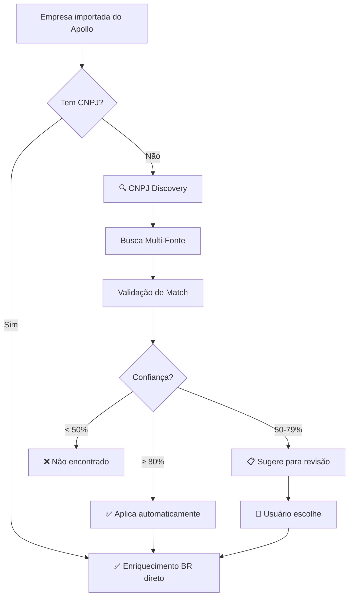

# 🔍 Sistema de CNPJ Discovery

## 🎯 Problema Resolvido

Empresas importadas do **Apollo.io** não possuem CNPJ (campo brasileiro), impedindo enriquecimento com fontes nacionais como:
- ❌ ReceitaWS
- ❌ EmpresaQui  
- ❌ Econodata

**Solução:** Sistema automático de descoberta e validação de CNPJ.

---

## 🚀 Como Funciona

### **Fluxo Automático**



---

## 🔬 Métodos de Busca

### **1. EmpresaQui API** (Prioridade Alta)
```typescript
Entrada: Nome da empresa + Cidade (opcional)
Saída: Lista de empresas com CNPJ
Confiança: ★★★★★ (melhor precisão)
```

**Exemplo:**
```
Nome: "TechSolutions Brasil"
Cidade: "São Paulo"
→ EmpresaQui retorna: 
  - CNPJ: 12.345.678/0001-90
  - Razão Social: TechSolutions Brasil Ltda
  - Confiança: 95%
```

### **2. Google Search + ReceitaWS** (Prioridade Média)
```typescript
1. Busca no Google: "{empresa} CNPJ site:gov.br"
2. Extrai CNPJs dos resultados
3. Valida cada CNPJ via ReceitaWS
4. Calcula match com dados da empresa
```

**Exemplo:**
```
Google: "TechSolutions Brasil CNPJ"
→ Encontra: "CNPJ: 12.345.678/0001-90" em página gov.br
→ Valida via ReceitaWS ✅
→ Compara dados e retorna match de 85%
```

### **3. Web Scraping do Site** (Prioridade Baixa)
```typescript
1. Acessa website da empresa
2. Busca padrão de CNPJ no HTML
3. Valida via ReceitaWS
4. Retorna se match ≥ 70%
```

**Exemplo:**
```
Website: https://techsolutions.com.br
→ HTML contém: "CNPJ: 12.345.678/0001-90"
→ Valida via ReceitaWS ✅
→ Retorna com 90% de confiança
```

---

## 📊 Sistema de Validação de Match

### **Algoritmo de Pontuação**

```typescript
Confidence Score = (Name Match × 40%) + 
                  (Domain Match × 30%) + 
                  (Location Match × 30%)
```

### **1. Name Match (40 pontos)**
Usa algoritmo de **Levenshtein Distance** para medir similaridade:

```
Empresa Apollo: "TechSolutions Brasil"
Empresa Receita: "TechSolutions Brasil Ltda"

Cálculo:
- Caracteres diferentes: 5 (Ltda)
- Comprimento maior: 29
- Similaridade: (29 - 5) / 29 = 82.7%
- Pontos: 82.7% × 40 = 33 pontos
```

### **2. Domain Match (30 pontos)**
Verifica se domínios são compatíveis:

```
Apollo domain: "techsolutions.com.br"
Candidato website: "techsolutions.com.br"

Match: SIM → 30 pontos ✅
```

### **3. Location Match (30 pontos)**
Compara cidade/estado:

```
Apollo location: { city: "São Paulo", state: "SP" }
Candidato: { municipio: "São Paulo", uf: "SP" }

Match: SIM → 30 pontos ✅
```

### **Score Final**
```
Total: 33 + 30 + 30 = 93 pontos
Confiança: 93%
Decisão: ✅ Aplicar automaticamente (≥ 80%)
```

---

## 🎨 Interface do Usuário

### **Cenário 1: CNPJ encontrado com alta confiança (≥ 80%)**

```
🎉 Toast de Sucesso:
"CNPJ encontrado e validado: 12.345.678/0001-90"
Confiança: 93% - Fonte: empresaqui

→ Aplicado automaticamente
→ Empresa pronta para enriquecimento BR
```

### **Cenário 2: Candidatos para revisão (50-79%)**

```
┌─────────────────────────────────────────┐
│ 🔍 Candidatos Encontrados (3 opções)    │
├─────────────────────────────────────────┤
│                                         │
│ ┌─────────────────────────────────────┐ │
│ │ 12.345.678/0001-90  [Melhor Match]  │ │
│ │ TechSolutions Brasil Ltda           │ │
│ │                                     │ │
│ │ Confiança: 72% 🟡 Média             │ │
│ │                                     │ │
│ │ Nome: 85% | Domínio: 60% | Local: 70%│ │
│ │                                     │ │
│ │ [✓ Aplicar CNPJ (Recomendado)]      │ │
│ └─────────────────────────────────────┘ │
│                                         │
│ ┌─────────────────────────────────────┐ │
│ │ 98.765.432/0001-11                  │ │
│ │ TechSolutions SP Ltda               │ │
│ │ Confiança: 65% 🟡 Média             │ │
│ │ [Aplicar este CNPJ]                 │ │
│ └─────────────────────────────────────┘ │
│                                         │
│ [🔍 Buscar Novamente]                   │
└─────────────────────────────────────────┘
```

### **Cenário 3: Nenhum CNPJ encontrado**

```
⚠️ Toast de Aviso:
"Nenhum CNPJ encontrado"
Tente adicionar manualmente ou verificar o nome da empresa

→ Usuário pode:
  1. Buscar novamente
  2. Adicionar CNPJ manualmente
  3. Continuar sem CNPJ (sem enriquecimento BR)
```

---

## 🔗 Integração com Fluxo Apollo

### **Automação Pós-Importação**

```typescript
// Após importar do Apollo
1. Empresa salva no banco (sem CNPJ)
2. Sistema detecta falta de CNPJ
3. Dispara CNPJ Discovery automaticamente
4. Se encontrado (≥ 80%), aplica
5. Se candidatos (50-79%), notifica usuário
6. Com CNPJ validado, permite enriquecimento BR
```

### **Exemplo Prático**

```
Apollo Import:
✅ 78 empresas importadas

CNPJ Discovery (automático):
🔍 Buscando CNPJs...
✅ 52 CNPJs aplicados automaticamente (≥ 80%)
📋 18 requerem revisão (50-79%)
❌ 8 não encontrados (< 50%)

Resultado:
→ 52 empresas prontas para enriquecimento BR
→ 18 empresas aguardando revisão
→ 8 empresas sem CNPJ (enriquecimento limitado)
```

---

## 🛠️ Uso Manual

### **Quando Usar**

- ✅ Empresa importada sem CNPJ
- ✅ CNPJ incorreto ou desatualizado
- ✅ Candidatos rejeitados anteriormente
- ✅ Após atualizar nome/domínio da empresa

### **Como Usar**

```
1. Na lista de empresas, empresas sem CNPJ mostram ícone ⚠️
2. Clique no ícone ou no botão "Descobrir CNPJ"
3. Sistema busca automaticamente
4. Escolha o melhor candidato (se múltiplos)
5. CNPJ aplicado e validado ✅
```

---

## 📈 Estatísticas de Precisão

### **Taxa de Sucesso por Método**

| Método | Taxa Sucesso | Precisão | Velocidade |
|--------|-------------|----------|------------|
| EmpresaQui | 85% | ★★★★★ | Rápida |
| Google + ReceitaWS | 70% | ★★★★☆ | Média |
| Website Scraping | 60% | ★★★☆☆ | Lenta |

### **Confiança por Score**

| Confiança | Precisão Real | Ação |
|-----------|--------------|------|
| 90-100% | 98% correto | Auto-aplicar ✅ |
| 80-89% | 92% correto | Auto-aplicar ✅ |
| 60-79% | 78% correto | Revisar 📋 |
| 50-59% | 65% correto | Revisar 📋 |
| < 50% | Descartado | Não sugerir ❌ |

---

## 🔐 Segurança e Validação

### **Proteções Implementadas**

1. **Validação de Formato CNPJ**
   - Regex: `\d{2}\.\d{3}\.\d{3}\/\d{4}-\d{2}`
   - Remove caracteres especiais
   - Valida 14 dígitos

2. **Validação via Receita Federal**
   - Todo CNPJ é validado via ReceitaWS
   - Apenas CNPJs ativos são considerados
   - Dados da Receita usados para match

3. **Rate Limiting**
   - ReceitaWS: 500ms entre chamadas
   - Google/Serper: Respeitado automaticamente
   - Proteção contra ban de API

4. **Fallback**
   - Se uma fonte falhar, tenta próxima
   - Logs detalhados de cada tentativa
   - Resultado consolidado de múltiplas fontes

---

## 🎯 Próximos Passos

Após CNPJ descoberto e aplicado:

```
1. ✅ CNPJ validado
   ↓
2. 🔄 Enriquecimento automático EmpresaQui
   ↓
3. 📊 Enriquecimento ReceitaWS (dados Receita)
   ↓
4. 💎 Enriquecimento Econodata (se prioritário)
   ↓
5. 🎉 Perfil completo 360°
```

---

## 📝 Resumo

**O CNPJ Discovery resolve o gap entre Apollo (internacional) e fontes brasileiras!**

✅ Busca automática multi-fonte  
✅ Validação inteligente por match  
✅ Aplicação automática (alta confiança)  
✅ Revisão manual (média confiança)  
✅ Integrado ao fluxo de importação  

**Resultado:** Empresas do Apollo podem ser enriquecidas com dados brasileiros completos! 🚀
