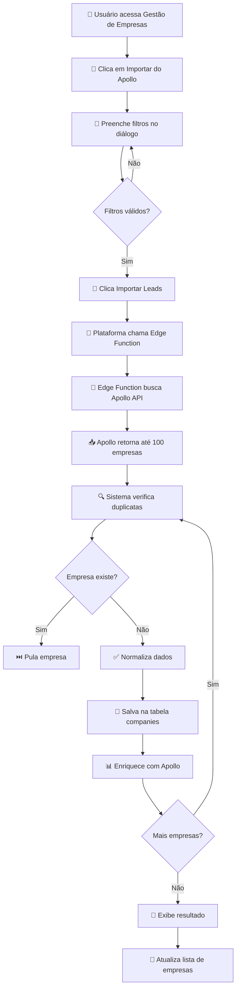

# 🚀 Fluxo de Importação Apollo.io

## 📊 Visão Geral

O sistema permite importar leads diretamente do **Apollo.io** para a plataforma, com filtros avançados e normalização automática de dados.

---

## 🎯 Como Funciona (Passo a Passo)

### **1. Acesso à Funcionalidade**
```
Página: Gestão de Empresas (/companies)
Botão: "Importar do Apollo" (roxo/azul no topo)
```

### **2. Configuração dos Filtros**

Você define os critérios de busca **DENTRO DA PLATAFORMA**:

#### **📍 Localização**
- **Onde filtrar:** Campo "Localização" no diálogo
- **Formato:** País, Estado ou Cidade separados por vírgula
- **Exemplo:** `Brazil`, `São Paulo, Brazil`, `Rio de Janeiro`
- **Resultado:** Apollo busca empresas nessas regiões

#### **🏢 Indústria/Setor**
- **Onde filtrar:** Campo "Indústria"
- **Formato:** Setor de atuação
- **Exemplo:** `Software`, `Retail`, `Healthcare`, `Manufacturing`
- **Resultado:** Apollo filtra por setor

#### **👥 Faixa de Funcionários**
- **Onde filtrar:** Dropdown "Faixa de Funcionários"
- **Opções:**
  - 1-10 funcionários
  - 11-50 funcionários
  - 51-200 funcionários
  - 201-500 funcionários
  - 501-1000 funcionários
  - 1001-5000 funcionários
  - 5001-10000 funcionários
  - 10001+ funcionários
- **Resultado:** Apollo filtra por porte da empresa

#### **🔍 Palavras-chave / Tecnologias**
- **Onde filtrar:** Campo "Palavras-chave"
- **Formato:** Tecnologias ou keywords relevantes
- **Exemplo:** `ERP`, `CRM`, `Cloud Computing`, `SAP`, `Oracle`
- **Resultado:** Apollo busca empresas que usam essas tecnologias

---

## 🔄 Fluxo Completo



---

## 📋 Dados Importados do Apollo

### **Campos Cadastrais**
- ✅ Nome da empresa
- ✅ Domínio/Website
- ✅ Indústria/Setor
- ✅ Número de funcionários

### **Localização**
- ✅ Cidade
- ✅ Estado
- ✅ País
- ✅ Endereço completo (quando disponível)

### **Digital**
- ✅ LinkedIn da empresa
- ✅ Tecnologias utilizadas
- ✅ Stack tecnológico

### **Metadados**
- ✅ Fonte: "apollo"
- ✅ Data de enriquecimento
- ✅ Raw data completo para auditoria

---

## 🎯 Exemplo Prático

### **Cenário:** Importar empresas de software em São Paulo com 51-200 funcionários

**1. Configuração:**
```
📍 Localização: "São Paulo, Brazil"
🏢 Indústria: "Software"
👥 Funcionários: "51-200 funcionários"
🔍 Keywords: "ERP, CRM, Cloud"
```

**2. Resultado Esperado:**
```
🔍 Apollo encontra: 100 empresas
✅ Importadas: 78 empresas (22 duplicatas)
📊 Total na plataforma: +78 novos leads
```

**3. Dados de cada empresa:**
```json
{
  "name": "TechSolutions Brasil",
  "domain": "techsolutions.com.br",
  "website": "https://techsolutions.com.br",
  "industry": "Software",
  "employees": 120,
  "location": {
    "city": "São Paulo",
    "state": "SP",
    "country": "Brazil"
  },
  "linkedin_url": "https://linkedin.com/company/techsolutions",
  "technologies": ["React", "Node.js", "AWS"],
  "enrichment_source": "apollo",
  "enriched_at": "2025-01-27T10:30:00Z"
}
```

---

## 🔐 Requisitos

### **1. Chave API Apollo**
- Necessário ter conta Apollo.io
- Gerar API Key em: Apollo Settings → API
- Configurar no sistema via Secrets

### **2. Limites Apollo**
- **100 empresas por busca**
- **Verificação de duplicatas automática**
- **Rate limits respeitados**

---

## 🎨 Interface

### **Botão Principal**
```tsx
Localização: Topo da página Gestão de Empresas
Aparência: Gradiente roxo-azul
Texto: "Importar do Apollo"
Ícone: Download
```

### **Diálogo de Importação**
```
┌─────────────────────────────────────────┐
│ 🚀 Importar Leads do Apollo.io          │
├─────────────────────────────────────────┤
│                                         │
│ 📍 Localização                          │
│ [_________________________________]     │
│                                         │
│ 🏢 Indústria                            │
│ [_________________________________]     │
│                                         │
│ 👥 Faixa de Funcionários                │
│ [▼ Selecione a faixa____________]      │
│                                         │
│ 🔍 Palavras-chave                       │
│ [_________________________________]     │
│                                         │
│ ℹ️ Apollo.io importa até 100 empresas   │
│    por busca. Duplicatas ignoradas.     │
│                                         │
│           [Cancelar] [Importar Leads]   │
└─────────────────────────────────────────┘
```

---

## 🔄 Após a Importação

### **1. Visualização**
As empresas aparecem imediatamente na lista de **Gestão de Empresas**

### **2. Badge de Fonte**
Cada empresa mostra badge "Apollo" indicando a origem

### **3. Enriquecimento Posterior**
Empresas podem ser enriquecidas com outras fontes:
- 📊 EmpresaQui (dados cadastrais BR)
- 💰 Econodata (dados financeiros premium)
- 📝 ReceitaWS (CNPJ validation)

### **4. Merge Inteligente**
Sistema usa **prioridade de campos** para decidir qual dado manter quando há conflito

---

## 💡 Dicas de Uso

### **✅ Boas Práticas**
1. **Seja específico nos filtros** - Mais filtros = leads mais qualificados
2. **Use keywords relevantes** - Tecnologias específicas aumentam precisão
3. **Combine múltiplos critérios** - Location + Industry + Size = melhor segmentação
4. **Importe em batches** - Várias buscas de 100 empresas com filtros diferentes

### **❌ Evite**
1. **Filtros muito amplos** - "Brazil" sem outros filtros = resultados genéricos
2. **Keywords genéricas** - "Technology" é menos útil que "SAP ERP"
3. **Importar tudo de uma vez** - Melhor segmentar por critérios

---

## 📊 Integração com Outros Sistemas

### **🔄 Fluxo Multi-Fonte Completo**

```
Apollo Import → [Empresa na Plataforma]
                      ↓
              [Enriquecimento Automático]
                      ↓
        ┌─────────────┼─────────────┐
        ↓             ↓             ↓
  EmpresaQui    ReceitaWS     Econodata
   (ilimitado)    (free)      (50/mês)
        ↓             ↓             ↓
        └─────────────┼─────────────┘
                      ↓
              [Merge Inteligente]
                      ↓
          [Perfil Completo 360°]
```

### **📈 Prioridade de Dados**
Quando há conflito entre fontes:

| Campo | Apollo | EmpresaQui | Econodata | Manual |
|-------|--------|------------|-----------|--------|
| Nome | 90 | 100 | 95 | 100 |
| Telefone | 80 | 85 | 95 | 100 |
| Email | 90 | 85 | 95 | 100 |
| LinkedIn | 95 | 80 | 85 | 100 |
| Tecnologias | 85 | 70 | 90 | 100 |
| Funcionários | 85 | 80 | 95 | 100 |

*Maior número = maior prioridade*

---

## 🚨 Troubleshooting

### **Erro: "APOLLO_API_KEY não configurada"**
**Solução:** Adicionar chave API nas configurações do sistema

### **Nenhuma empresa importada**
**Possíveis causas:**
- Filtros muito restritivos
- Todas as empresas já existem (duplicatas)
- Erro na chave API

### **Importadas menos que 100**
**Normal!** Apollo retorna baseado em critérios e disponibilidade

---

## 📝 Resumo

**Você filtra AQUI na plataforma** → Sistema busca no Apollo → Empresas são importadas automaticamente → Dados normalizados e salvos → Enriquecimento multi-fonte disponível

**Simples, rápido e automático! 🎉**
