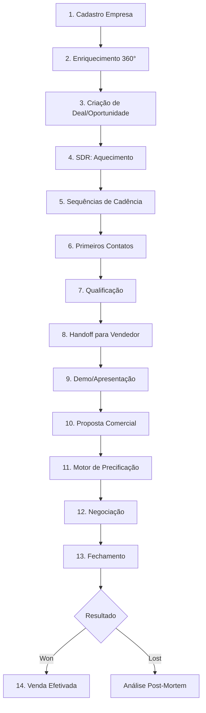

# Fluxo Completo: Do Cadastro à Venda Efetivada

## 📊 Visão Geral do Processo



---

## 1️⃣ CADASTRO DE EMPRESA

### Entrada de Dados
**Onde:** `/search` ou `/companies` (Bulk Upload)

**Tabelas:**
- `companies` - Dados básicos da empresa

**Processo:**
1. Usuário busca empresa por CNPJ, nome ou domínio
2. Sistema busca em fontes externas (ReceitaWS, Google, etc.)
3. Preview dos dados encontrados
4. Usuário salva empresa no banco

**Campos iniciais:**
- Nome, CNPJ, website, domain
- Indústria, número de funcionários
- Localização (cidade, estado, lat/long)

---

## 2️⃣ ENRIQUECIMENTO AUTOMÁTICO 360°

### Fontes de Dados
**Edge Function:** `enrich-company-360`

**Adaptadores usados:**
1. **ReceitaWS** - Dados cadastrais e financeiros
2. **Apollo.io** - Decisores e contatos
3. **PhantomBuster** - LinkedIn scraping
4. **Hunter.io** - Verificação de emails
5. **Serper/Google** - Notícias e sinais digitais
6. **Tech Stack** - Tecnologias utilizadas

**Dados enriquecidos:**
- `decision_makers` - Executivos e decisores
- `digital_presence` - Presença digital e social
- `governance_signals` - Sinais de maturidade
- `digital_maturity` - Score de maturidade digital
- `financial_data` - Dados financeiros e credit score
- `legal_data` - Processos e pendências legais

**Armazenamento:**
- `analysis_runs` - Log de execução
- `analysis_artifacts` - Dados brutos por fonte
- `company_snapshots` - Snapshot histórico

---

## 3️⃣ CRIAÇÃO DE DEAL/OPORTUNIDADE

### ⚠️ GAP IDENTIFICADO
**Status atual:** NÃO HÁ AUTOMAÇÃO

**Como deveria funcionar:**
Quando empresa é enriquecida → Criar automaticamente um Deal em `sdr_deals`

**Proposta de implementação:**
```sql
-- Trigger ou Edge Function
CREATE OR REPLACE FUNCTION auto_create_deal_after_enrichment()
RETURNS TRIGGER AS $$
BEGIN
  -- Se empresa foi enriquecida, criar deal automaticamente
  IF NEW.digital_maturity_score IS NOT NULL THEN
    INSERT INTO sdr_deals (
      company_id,
      title,
      stage,
      priority,
      status,
      value,
      probability,
      next_action,
      next_action_date
    ) VALUES (
      NEW.id,
      'Prospecção - ' || NEW.name,
      'discovery',
      CASE 
        WHEN NEW.digital_maturity_score > 70 THEN 'high'
        WHEN NEW.digital_maturity_score > 50 THEN 'medium'
        ELSE 'low'
      END,
      'open',
      50000, -- Valor padrão
      30, -- Probabilidade inicial
      'Iniciar contato com decisor',
      NOW() + INTERVAL '2 days'
    );
  END IF;
  RETURN NEW;
END;
$$ LANGUAGE plpgsql;
```

---

## 4️⃣ SDR: FASE DE AQUECIMENTO

### Workspace SDR
**Onde:** `/sdr/workspace`

**Tabela principal:** `sdr_deals`

**Estágios iniciais:**
- **discovery** - Pesquisa e qualificação inicial
- **outreach** - Tentativas de contato ativo

**Automações ativas** (`useSDRAutomations`):
1. **SLA Alert** - Deal próximo do prazo de fechamento
2. **Stale Deal** - Deal parado há mais de 7 dias
3. **Follow-up** - Necessidade de follow-up no estágio
4. **Next Action** - Sugestão de próxima ação

**Sistema de Priorização:**
```typescript
priority: 'low' | 'medium' | 'high' | 'urgent'
```

Critérios:
- Digital Maturity Score
- Tamanho da empresa (employees/revenue)
- Sinais de compra (governance_signals)
- Tempo no funil

---

## 5️⃣ SEQUÊNCIAS DE CADÊNCIA

### Sistema de Automação
**Tabelas:**
- `sdr_sequences` - Definição da sequência
- `sdr_sequence_steps` - Passos da cadência
- `sdr_sequence_runs` - Execução por contato

**Edge Function:** `sdr-sequence-runner` (cron job a cada minuto)

**Exemplo de sequência:**
```
Day 0:  Email inicial + LinkedIn connection request
Day +2: Email follow-up 1
Day +5: WhatsApp message
Day +7: Email follow-up 2 + Chamada telefônica
Day +10: Email "break-up" (última tentativa)
```

**Templates de mensagem:**
- Variáveis: `{{contact.name}}`, `{{company.name}}`, `{{company.industry}}`
- Armazenadas em `sdr_templates`

**Canais suportados:**
- Email (SMTP/IMAP)
- WhatsApp (Twilio)
- LinkedIn (PhantomBuster - futuro)

---

## 6️⃣ PRIMEIROS CONTATOS

### Inbox Unificado
**Onde:** `/sdr/inbox` ou `/sdr/workspace` (tab Inbox)

**Tabelas:**
- `conversations` - Thread de conversa
- `messages` - Mensagens individuais
- `contacts` - Contatos da empresa

**Canais integrados:**
- Email (IMAP polling via `email-imap-sync`)
- WhatsApp (webhook Twilio)

**Recursos:**
- Respostas sugeridas por IA (`ai-suggest-replies`)
- Histórico completo de interações
- Tags e priorização (SLA)

**Registro de atividades:**
- `sdr_deal_activities` - Log de todas as interações
- Tipos: call, email, meeting, whatsapp, linkedin

---

## 7️⃣ QUALIFICAÇÃO DO LEAD

### Critérios BANT
**Budget** - Capacidade financeira
- `financial_data.credit_score`
- `companies.revenue`
- `financial_data.risk_classification`

**Authority** - Decisor identificado
- `decision_makers` com `seniority = 'C-Level' ou 'Director'`
- `buyer_personas` mapeadas

**Need** - Necessidade identificada
- `governance_signals` com gaps detectados
- `digital_maturity_score` < 70

**Timeline** - Urgência/prazo
- `sdr_deals.expected_close_date`
- Sinais de compra recentes

### Score de Qualificação
**Campo:** `sdr_deals.probability` (0-100%)

**Cálculo automático** (`useAutomationEngine`):
```javascript
probability = 
  (budgetScore * 0.3) +
  (authorityScore * 0.25) +
  (needScore * 0.25) +
  (timelineScore * 0.2)
```

---

## 8️⃣ HANDOFF SDR → VENDEDOR

### ⚠️ GAP IDENTIFICADO
**Status atual:** NÃO HÁ PROCESSO FORMAL

**Como deveria funcionar:**
Quando deal atinge `probability >= 50%` e `stage = 'demo'` → Atribuir a vendedor

**Proposta:**
1. **Campo adicional:** `sdr_deals.assigned_sales_rep` (uuid)
2. **Notificação automática** via `sdr_notifications`
3. **Handoff checklist:**
   - Resumo da pesquisa (Canvas)
   - Decisores identificados
   - Pontos de dor mapeados
   - Histórico de comunicação

**Tabela auxiliar sugerida:**
```sql
CREATE TABLE sdr_handoffs (
  id UUID PRIMARY KEY DEFAULT gen_random_uuid(),
  deal_id UUID REFERENCES sdr_deals(id),
  from_sdr UUID REFERENCES profiles(id),
  to_sales_rep UUID REFERENCES profiles(id),
  handoff_notes TEXT,
  checklist JSONB,
  handoff_date TIMESTAMPTZ DEFAULT NOW()
);
```

---

## 9️⃣ DEMO / APRESENTAÇÃO

### Estágio: `demo`
**Responsável:** Vendedor (Sales Rep)

**Ferramentas:**
- **Canvas estratégico** (`/canvas`) - Preparação da demo
- **Competitive Intelligence** (`/competitive`) - Battle cards
- **Buyer Personas** (`/personas`) - Mensagens personalizadas

**Durante a demo:**
- Gravação via Twilio (`call_recordings`)
- Transcrição automática (`transcription_sid`)
- Notas no Canvas (blocks tipo `note`)

**Pós-demo:**
- Atualizar `sdr_deals.probability`
- Criar tasks de follow-up (`sdr_tasks`)
- Avançar para `stage = 'proposal'`

---

## 🔟 PROPOSTA COMERCIAL

### Sistema de Propostas
**Tabela:** `visual_proposals`

**Edge Function:** `generate-visual-proposal`

**Vinculações:**
- `company_id` - Empresa alvo
- `account_strategy_id` - Estratégia de conta (opcional)
- `quote_id` - Cotação com preços (opcional)
- `scenario_id` - Cenário de ROI (opcional)

**Estrutura da proposta:**
```json
{
  "sections": [
    {
      "type": "cover",
      "title": "Proposta de Transformação Digital",
      "company_logo": "...",
      "customer_name": "..."
    },
    {
      "type": "executive_summary",
      "content": "Resumo executivo baseado em account_strategy"
    },
    {
      "type": "situation_analysis",
      "current_state": "Análise da situação atual",
      "pain_points": ["Ponto 1", "Ponto 2"],
      "opportunities": ["Oportunidade 1"]
    },
    {
      "type": "solution",
      "products": [...],
      "implementation_plan": {...}
    },
    {
      "type": "investment",
      "pricing_table": {...},
      "payment_terms": "..."
    },
    {
      "type": "roi_analysis",
      "scenario": {...}
    },
    {
      "type": "testimonials",
      "cases": [...]
    },
    {
      "type": "next_steps",
      "timeline": {...}
    }
  ]
}
```

**Workflow de aprovação:**
```
draft → review → approved → sent → viewed → accepted/rejected
```

---

## 1️⃣1️⃣ MOTOR DE PRECIFICAÇÃO (CPQ)

### Quote Engine
**Tabela:** `quote_history`

**Edge Function:** `calculate-quote-pricing`

**Componente:** `QuoteConfigurator`

**Catálogo de produtos:**
- `product_catalog` - SKUs TOTVS disponíveis
- Configurações por produto (modules, users, etc.)

**Cálculo dinâmico:**
```javascript
// Exemplo de regra de desconto
if (deal.probability > 70) {
  maxDiscount = 15%;
} else if (competitorDetected) {
  maxDiscount = 20%; // Aggressive pricing
}

finalPrice = listPrice * (1 - discount) * quantity;
```

**Campos calculados:**
- `total_list_price` - Preço de tabela
- `total_discounts` - Total de descontos
- `total_final_price` - Preço final
- `suggested_price` - Sugestão IA baseada em histórico
- `win_probability` - Probabilidade de ganhar com esse preço
- `competitive_position` - aggressive/competitive/premium/high_risk

**Integração com proposta:**
- Quote gerada → Vinculada a `visual_proposals.quote_id`
- Seção "Investment" da proposta usa dados da quote

---

## 1️⃣2️⃣ NEGOCIAÇÃO

### Estágio: `negotiation`
**Responsável:** Vendedor + Manager (aprovações)

**Ferramentas:**
- **Cenários de ROI** (`scenario_analysis`) - Justificar investimento
- **TCO Comparison** - Comparação com concorrentes
- **Value Realization** - Benefícios esperados

**Interações registradas:**
- Reuniões de negociação (`sdr_deal_activities`)
- Ajustes de proposta (versões em `visual_proposals`)
- Revisão de preços (novas quotes)

**Aprovações:**
- Descontos acima de 15% → Requer aprovação de manager
- Descontos acima de 25% → Requer aprovação de diretor

**Tabela sugerida:**
```sql
CREATE TABLE deal_approvals (
  id UUID PRIMARY KEY DEFAULT gen_random_uuid(),
  deal_id UUID REFERENCES sdr_deals(id),
  quote_id UUID REFERENCES quote_history(id),
  requested_by UUID REFERENCES profiles(id),
  approved_by UUID REFERENCES profiles(id),
  discount_requested NUMERIC,
  justification TEXT,
  status TEXT, -- pending/approved/rejected
  created_at TIMESTAMPTZ DEFAULT NOW()
);
```

---

## 1️⃣3️⃣ FECHAMENTO

### Deal Won
**Ação:** Atualizar `sdr_deals`:
```sql
UPDATE sdr_deals SET
  stage = 'won',
  status = 'won',
  won_date = NOW(),
  probability = 100
WHERE id = :deal_id;
```

**Webhook disparado:**
- Event: `deal.won`
- Payload: Deal completo + company + quote + proposal
- Destinos: CRM externo, ERP, sistema de faturamento

**Proposta aceita:**
```sql
UPDATE visual_proposals SET
  status = 'accepted',
  signed_at = NOW()
WHERE id = :proposal_id;
```

### Deal Lost
```sql
UPDATE sdr_deals SET
  stage = 'lost',
  status = 'lost',
  lost_date = NOW(),
  lost_reason = :reason,
  lost_to_competitor = :competitor_id
WHERE id = :deal_id;
```

**Análise post-mortem:**
- Motivo da perda
- Concorrente vencedor
- Preço vs. concorrente
- Lições aprendidas

---

## 1️⃣4️⃣ VENDA EFETIVADA

### Pós-venda
**Responsável:** Customer Success

**Integrações necessárias:**
1. **ERP/Faturamento** - Emissão de nota fiscal
2. **Onboarding** - Kick-off e implementação
3. **Support** - Sistema de tickets
4. **Value Tracking** - Acompanhamento de ROI realizado

**Tabela de onboarding sugerida:**
```sql
CREATE TABLE customer_onboarding (
  id UUID PRIMARY KEY DEFAULT gen_random_uuid(),
  deal_id UUID REFERENCES sdr_deals(id),
  company_id UUID REFERENCES companies(id),
  onboarding_status TEXT, -- scheduled/in_progress/completed
  kickoff_date DATE,
  go_live_date DATE,
  assigned_csm UUID REFERENCES profiles(id),
  implementation_plan JSONB,
  milestones JSONB
);
```

---

## 🔗 COMO TUDO SE INTEGRA

### Fluxo de Dados Entre Módulos

```
companies
  └─> analysis_runs (enriquecimento)
       └─> decision_makers
       └─> digital_presence
       └─> governance_signals
  └─> sdr_deals (vendas)
       └─> conversations (comunicação)
            └─> messages
       └─> sdr_tasks (ações)
       └─> sdr_sequence_runs (cadência)
  └─> account_strategies (planejamento)
       └─> business_cases
       └─> scenario_analysis
       └─> quote_history (cotação)
            └─> visual_proposals (proposta)
                 └─> deal fechado (won)
```

### Foreign Keys Importantes

**Existentes:**
- ✅ `sdr_deals.company_id` → `companies.id`
- ✅ `sdr_deals.contact_id` → `contacts.id`
- ✅ `conversations.company_id` → `companies.id`
- ✅ `account_strategies.company_id` → `companies.id`

**Faltando (⚠️ GAPS):**
- ❌ `sdr_deals.quote_id` → `quote_history.id`
- ❌ `sdr_deals.proposal_id` → `visual_proposals.id`
- ❌ `visual_proposals.quote_id` → `quote_history.id`
- ❌ `quote_history.deal_id` → `sdr_deals.id`

---

## 🐛 GAPS E MELHORIAS NECESSÁRIAS

### 1. Automação de Deal Creation
**Problema:** Empresas enriquecidas não viram deals automaticamente

**Solução:**
- Trigger ou Edge Function ao completar enrichment
- Criar deal com prioridade baseada em maturity score

### 2. Handoff SDR → Vendedor
**Problema:** Não há processo formal de passagem

**Solução:**
- Campo `assigned_sales_rep` em `sdr_deals`
- Tabela `sdr_handoffs` com checklist
- Notificação automática

### 3. Vinculação Quote ↔ Deal
**Problema:** Não há foreign key ligando cotação ao deal

**Solução:**
```sql
ALTER TABLE sdr_deals ADD COLUMN quote_id UUID REFERENCES quote_history(id);
ALTER TABLE sdr_deals ADD COLUMN proposal_id UUID REFERENCES visual_proposals(id);
```

### 4. Aprovação de Descontos
**Problema:** Não há workflow de aprovação

**Solução:**
- Tabela `deal_approvals`
- Notificações para aprovadores
- Histórico de aprovações/rejeições

### 5. Integração ERP/Faturamento
**Problema:** Venda efetivada não integra com sistemas externos

**Solução:**
- Webhook `deal.won` configurável
- API REST para consulta (`sdr-api-public`)
- Tabela `customer_onboarding` para pós-venda

### 6. Analytics de Conversão
**Problema:** Difícil analisar funil completo

**Solução:**
- View materializada agregando dados
- Dashboard executivo com métricas
- Forecast de pipeline

---

## 📊 MÉTRICAS CHAVE (KPIs)

### Velocidade do Funil
```sql
SELECT 
  stage,
  AVG(EXTRACT(EPOCH FROM (updated_at - created_at)) / 86400) as avg_days_in_stage
FROM sdr_deals
GROUP BY stage;
```

### Taxa de Conversão por Estágio
```sql
SELECT 
  COUNT(CASE WHEN stage = 'discovery' THEN 1 END) as discovery,
  COUNT(CASE WHEN stage = 'demo' THEN 1 END) as demo,
  COUNT(CASE WHEN stage = 'proposal' THEN 1 END) as proposal,
  COUNT(CASE WHEN stage = 'won' THEN 1 END) as won,
  ROUND(100.0 * COUNT(CASE WHEN stage = 'won' THEN 1 END) / 
    NULLIF(COUNT(CASE WHEN stage = 'discovery' THEN 1 END), 0), 2) as conversion_rate
FROM sdr_deals;
```

### Valor Médio de Deal
```sql
SELECT 
  AVG(value) as avg_deal_value,
  AVG(CASE WHEN status = 'won' THEN value END) as avg_won_deal_value
FROM sdr_deals;
```

### Tempo Médio de Fechamento
```sql
SELECT 
  AVG(EXTRACT(EPOCH FROM (won_date - created_at)) / 86400) as avg_days_to_close
FROM sdr_deals
WHERE status = 'won';
```

---

## 🎯 RESUMO EXECUTIVO

### O que funciona ✅
1. Cadastro e enriquecimento de empresas
2. Pipeline Kanban visual (deals)
3. Inbox unificado (email + WhatsApp)
4. Sequências de cadência automáticas
5. Sistema de propostas visuais
6. Motor de precificação (CPQ)
7. API REST e webhooks

### O que precisa melhorar ⚠️
1. Automação de criação de deals
2. Processo formal de handoff SDR → Vendedor
3. Vinculação de cotação e proposta ao deal
4. Workflow de aprovação de descontos
5. Integração com ERP/faturamento
6. Analytics de funil completo
7. Onboarding pós-venda

### Próximas implementações 🚀
1. Trigger de auto-criação de deal
2. Campo `assigned_sales_rep` e tabela `sdr_handoffs`
3. Foreign keys: `deal.quote_id` e `deal.proposal_id`
4. Tabela `deal_approvals`
5. Webhook `deal.won` com integração configurável
6. Dashboard executivo com métricas de conversão
