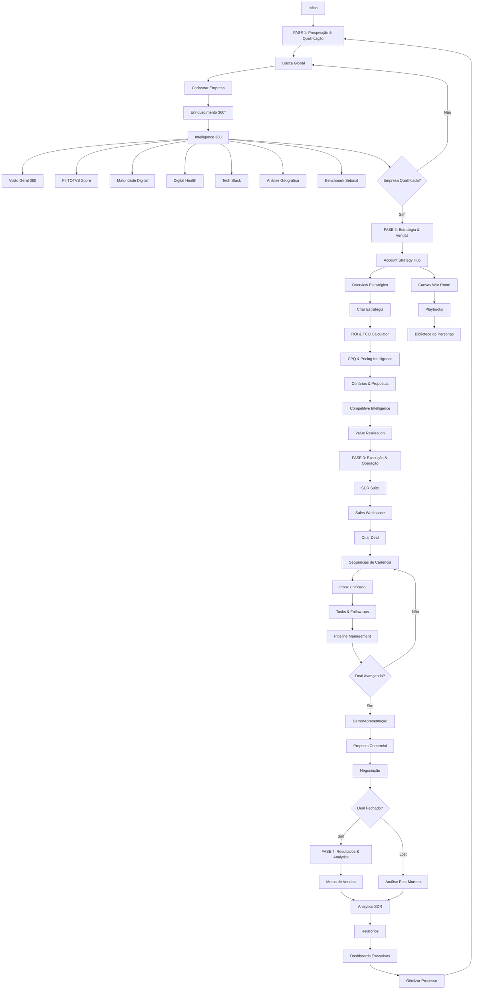
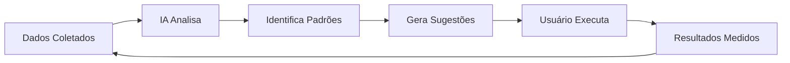

# Fluxo Completo Guiado por IA - Plataforma OLV Intelligence

## 🎯 Visão Geral

Este documento descreve como o **AI Copilot** guia o usuário através de **TODAS as 4 fases** da plataforma, desde a prospecção inicial até resultados e analytics, utilizando cada feature de forma inteligente e contextual.

---

## 📊 Mapa Mental do Fluxo Completo



---

## 🚀 FASE 1: PROSPECÇÃO & QUALIFICAÇÃO

### Objetivo
Identificar e qualificar empresas com alto potencial de conversão.

---

### 1.1 **Início - Dashboard Executivo**
**Página:** `/dashboard`

**IA detecta:**
- Usuário novo ou sem empresas cadastradas
- Base de empresas vazia ou desatualizada
- Oportunidades perdidas (empresas qualificadas sem deal)

**Sugestões:**
```
🎯 AÇÃO: Começar Prospecção
"Você ainda não tem empresas cadastradas. Vamos começar!"
[Ir para Busca Global >]

💡 INSIGHT: Pipeline Vazio
"Identifique novas oportunidades para acelerar vendas."
[Buscar Empresas >]

📊 OPORTUNIDADE: 12 empresas sem deal
"Empresas enriquecidas aguardando análise estratégica."
[Ver Lista >]
```

---

### 1.2 **Busca Global**
**Página:** `/search`

**IA detecta:**
- Busca sem resultados
- Empresa já existente no banco
- Empresa com alta probabilidade de fit

**Sugestões:**
```
🔍 DICA: Refine sua busca
"Use CNPJ ou domínio para resultados mais precisos."

✅ EMPRESA ENCONTRADA: Acme Corp
"Empresa já cadastrada. Score de Fit: 85/100"
[Ver Análise 360° >]

⚡ ALTO POTENCIAL: TechStart Ltda
"Fit TOTVS: 92/100 | 250 funcionários | Tech Stack moderno"
[Cadastrar Agora >]
```

---

### 1.3 **Base de Empresas**
**Página:** `/companies`

**IA detecta:**
- Empresas sem enriquecimento 360°
- Empresas com dados desatualizados (>30 dias)
- Empresas com score alto sem deal

**Sugestões:**
```
🔄 ATUALIZAR DADOS: 5 empresas desatualizadas
"Dados com mais de 30 dias. Enriqueça novamente."
[Enriquecer Batch >]

🎯 ALTA PRIORIDADE: Innovate SA
"Score 88/100, 500 funcionários, sem deal criado"
[Criar Deal Agora >]

📊 ANÁLISE PENDENTE: 8 empresas
"Enriquecimento completo, aguardando análise de Fit"
[Analisar Fit TOTVS >]
```

---

### 1.4 **Intelligence 360°**
**Módulo completo de análise profunda**

#### 1.4.1 **Visão Geral 360**
**Página:** `/intelligence/360/:id`

**IA detecta:**
- Campos vazios críticos (decisores, tech stack)
- Sinais de compra (governança, maturidade baixa)
- Oportunidades de cross-sell/upsell

**Sugestões:**
```
⚠️ DADOS INCOMPLETOS: Decisores não identificados
"Critical: Sem contato de C-Level mapeado"
[Buscar Decisores >]

🔥 SINAL DE COMPRA: Gap de Governança Detectado
"Score de maturidade: 45/100. Necessita transformação digital."
[Criar Estratégia de Conta >]

💎 OPORTUNIDADE: Tech Stack fragmentado
"12 sistemas diferentes. Potencial para integração TOTVS."
[Calcular ROI de Integração >]
```

---

#### 1.4.2 **Fit TOTVS Score**
**Página:** `/intelligence/fit-totvs/:id`

**IA analisa:**
- Score de fit (0-100)
- Produtos recomendados
- Probabilidade de conversão

**Sugestões:**
```
✅ FIT EXCELENTE: 92/100
"Empresa ideal para TOTVS Protheus + Fluig"
[Ver Produtos Recomendados >]

📈 POTENCIAL ALTO: Score 78/100
"Fit moderado mas com sinais de expansão rápida"
[Criar Proposta Consultiva >]

⚠️ FIT BAIXO: 42/100
"Empresa pequena, considere abordagem entry-level"
[Ver Alternativas >]
```

---

#### 1.4.3 **Maturidade Digital**
**Página:** `/intelligence/maturity/:id`

**IA detecta:**
- Score de maturidade por pilar
- Gaps críticos de transformação
- Oportunidades de consultoria

**Sugestões:**
```
🔴 GAP CRÍTICO: Infraestrutura (Score 32/100)
"Sistemas legados sem integração. ROI estimado: R$ 2.5M"
[Criar Business Case >]

🟡 OPORTUNIDADE: Processos (Score 58/100)
"Automação parcial. Potencial de ganho: 35%"
[Calcular ROI de Automação >]

🟢 FORTALEZA: Segurança (Score 87/100)
"Boa base de compliance. Cross-sell para GRC."
[Ver Produtos Complementares >]
```

---

#### 1.4.4 **Digital Health Score**
**Página:** `/intelligence/digital-presence/:id`

**IA analisa:**
- Presença digital (web, redes sociais)
- Engajamento online
- Sinais de crescimento

**Sugestões:**
```
📱 PRESENÇA FORTE: Score 82/100
"LinkedIn ativo, site moderno. Empresa em expansão."
[Ver Sinais de Crescimento >]

⚠️ PRESENÇA FRACA: Score 34/100
"Pouca presença digital pode indicar resistência a tech."
[Ajustar Abordagem >]

🔥 SINAL DE COMPRA: 3 vagas abertas para TI
"Contratação de tech indica investimento em digital."
[Acelerar Prospecção >]
```

---

#### 1.4.5 **Tech Stack**
**Página:** `/intelligence/tech-stack/:id`

**IA identifica:**
- Tecnologias utilizadas
- Concorrentes instalados
- Oportunidades de substituição

**Sugestões:**
```
⚡ CONCORRENTE DETECTADO: SAP instalado
"Empresa usa SAP B1. Prepare battle card."
[Ver Battle Card SAP >]

💎 OPORTUNIDADE: Stack fragmentado
"15 ferramentas diferentes. Consolidação = economia."
[Calcular TCO vs TOTVS >]

✅ COMPATÍVEL: Microsoft Stack
"Integração nativa com TOTVS. Argumento de venda!"
[Ver Casos de Integração >]
```

---

#### 1.4.6 **Análise Geográfica**
**Página:** `/intelligence/geographic/:id`

**IA detecta:**
- Localização e raio de atuação
- Proximidade de escritórios TOTVS
- Clusters de clientes

**Sugestões:**
```
📍 PROXIMIDADE: Escritório TOTVS SP a 5km
"Facilita visitas técnicas e suporte presencial."
[Agendar Visita >]

🌎 EXPANSÃO: Filiais em 3 estados
"Multi-site = necessidade de solução centralizada."
[Propor Cloud TOTVS >]

🎯 CLUSTER: 8 clientes TOTVS no raio de 10km
"Networking e cases locais disponíveis."
[Ver Casos Próximos >]
```

---

#### 1.4.7 **Benchmark Setorial**
**Página:** `/intelligence/benchmark/:id`

**IA compara:**
- Performance vs setor
- Maturidade vs concorrentes
- Oportunidades de diferenciação

**Sugestões:**
```
📊 ABAIXO DO SETOR: Maturidade 45 vs Média 68
"Empresa atrasada. Urgência de transformação digital."
[Criar Sense of Urgency >]

🏆 LÍDER DE SETOR: Top 10% em maturidade
"Busca inovação contínua. Abordagem premium."
[Propor Soluções Avançadas >]

⚖️ NA MÉDIA: Score 62 vs Média 65
"Oportunidade de diferenciação competitiva."
[Mostrar ROI de Inovação >]
```

---

### ✅ **Checkpoint Fase 1**

**IA verifica se empresa está qualificada:**
```
✅ EMPRESA QUALIFICADA: Acme Corp
- Fit Score: 88/100
- Maturidade: 62/100 (gaps identificados)
- Decisores: 3 mapeados
- Tech Stack: SAP (substituível)
- Sinais de compra: Expansão + contratações

PRÓXIMO PASSO: Criar Estratégia de Conta
[Ir para Account Strategy Hub >]
```

---

## 💼 FASE 2: ESTRATÉGIA & VENDAS

### Objetivo
Planejar abordagem estratégica e construir proposta de valor personalizada.

---

### 2.1 **Account Strategy Hub**
**Página:** `/account-strategy`

#### 2.1.1 **Overview Estratégico**

**IA sugere:**
```
🎯 CRIAR ESTRATÉGIA: Acme Corp
"Empresa qualificada aguardando planejamento estratégico."
[Nova Estratégia >]

📋 ESTRATÉGIAS PENDENTES: 3 em rascunho
"Finalize estratégias para avançar deals."
[Ver Rascunhos >]

🔥 PRIORIDADE ALTA: InnovateTech
"Deal há 45 dias sem estratégia formal."
[Criar Urgente >]
```

---

#### 2.1.2 **Criar Estratégia de Conta**

**IA guia passo-a-passo:**
```
📝 PASSO 1: Mapear Stakeholders
"Identifique decisores-chave e influenciadores."
[Usar Personas >]

🎯 PASSO 2: Definir Value Proposition
"Baseado em gaps de maturidade detectados."
[Gerar com IA >]

📊 PASSO 3: Calcular ROI
"Justificar investimento com dados concretos."
[Ir para ROI Calculator >]

💰 PASSO 4: Montar Proposta
"Produtos + Serviços + Investimento."
[Ir para CPQ >]
```

---

#### 2.1.3 **ROI & TCO Calculator**
**Página:** `/intelligence/roi-calculator/:id`

**IA calcula automaticamente:**
```
💵 ROI ESTIMADO: R$ 2.8M em 3 anos
- Economia de processos: R$ 1.2M
- Redução de sistemas: R$ 800K
- Ganho de produtividade: R$ 800K

Payback: 18 meses
[Gerar Relatório ROI >]

📉 TCO ATUAL vs TOTVS
Sistemas atuais: R$ 450K/ano
TOTVS integrado: R$ 280K/ano
ECONOMIA: 38% ao ano
[Incluir em Proposta >]
```

---

#### 2.1.4 **CPQ & Pricing Intelligence**
**Página:** `/cpq/:dealId`

**IA recomenda:**
```
💎 PRODUTOS RECOMENDADOS:
- TOTVS Protheus ERP (SKU-001)
- TOTVS Fluig BPM (SKU-015)
- TOTVS Carol AI (SKU-032)

Total Lista: R$ 450.000
Desconto Sugerido: 12% (R$ 54.000)
PREÇO FINAL: R$ 396.000

Win Probability: 78%
Competitive Position: Competitive
[Gerar Cotação >]

⚠️ ALERTA: Desconto solicitado 25%
"Acima do limite. Requer aprovação de Diretor."
[Solicitar Aprovação >]
```

---

#### 2.1.5 **Cenários & Propostas**
**Página:** `/scenarios/:strategyId`

**IA cria cenários:**
```
📊 CENÁRIO 1: Conservative (R$ 280K)
- Protheus ERP + Implementação básica
- ROI: 24 meses | Win Prob: 85%

📊 CENÁRIO 2: Balanced (R$ 396K)
- Protheus + Fluig + Carol IA
- ROI: 18 meses | Win Prob: 78%

📊 CENÁRIO 3: Aggressive (R$ 580K)
- Suite completa + Consultoria avançada
- ROI: 15 meses | Win Prob: 62%

RECOMENDAÇÃO IA: Cenário 2 (Balanced)
[Criar Proposta >]
```

---

#### 2.1.6 **Competitive Intelligence**
**Página:** `/competitive`

**IA alerta:**
```
⚠️ CONCORRENTE: SAP detectado
"Empresa atual usa SAP B1."
[Ver Battle Card >]

💪 VANTAGENS TOTVS:
1. Custo 40% menor
2. Implementação 50% mais rápida
3. Suporte local em português
4. Integração nativa com Microsoft

ESTRATÉGIA: Atacar TCO e suporte
[Ver Histórico de Wins vs SAP >]

🎯 WIN RATE vs SAP: 67%
"Argumento forte: 2 de 3 deals ganhos."
[Ver Cases de Sucesso >]
```

---

#### 2.1.7 **Value Realization**
**Página:** `/value-realization/:dealId`

**IA projeta:**
```
📈 VALOR ENTREGUE PROJETADO:
Ano 1: R$ 850K
Ano 2: R$ 1.2M
Ano 3: R$ 1.8M
TOTAL: R$ 3.85M

🎯 QUICK WINS (Primeiros 90 dias):
- Integração de 5 sistemas: R$ 120K economia
- Automação de aprovações: 200h/mês
- Redução de erros: 40%

[Incluir em Proposta Executiva >]
```

---

### 2.2 **Canvas (War Room)**
**Página:** `/canvas/:id`

**IA sugere blocos:**
```
📝 BLOCO SUGERIDO: Insight
"SAP atual tem alto custo de manutenção."
[Adicionar ao Canvas >]

✅ BLOCO SUGERIDO: Decisão
"Agendar demo técnica para CTO."
[Criar Task Automática >]

🔗 BLOCO SUGERIDO: Referência
"Case: Empresa similar reduziu 45% de custos."
[Link para Case >]

⚡ PRÓXIMA AÇÃO RECOMENDADA:
"Enviar proposta de POC gratuito."
[Criar Proposta >]
```

---

### 2.3 **Playbooks**
**Página:** `/playbooks`

**IA recomenda:**
```
📚 PLAYBOOK RECOMENDADO: "Substituição SAP"
"Baseado no tech stack da empresa."
[Ver Playbook >]

🎯 ETAPA ATUAL: Discovery (60% completo)
"Próximo: Mapear objeções técnicas."
[Ver Checklist >]

✅ AÇÕES PENDENTES:
- [ ] Coletar requisitos técnicos
- [ ] Agendar demo para TI
- [ ] Preparar comparativo TCO
[Marcar como Feito >]
```

---

### 2.4 **Biblioteca de Personas**
**Página:** `/personas`

**IA identifica:**
```
👤 PERSONA DETECTADA: CTO Tech-Savvy
"Tomador de decisão técnica identificado."

ABORDAGEM RECOMENDADA:
- Linguagem: Técnica, métricas, ROI
- Canais: LinkedIn, email técnico
- Objeções: "Lock-in de vendor"
- Motivadores: Inovação, escalabilidade

MENSAGENS-CHAVE:
1. "Arquitetura moderna e APIs abertas"
2. "Integração nativa com cloud providers"
3. "Roadmap de IA e ML"

[Usar em Sequência >]
```

---

### ✅ **Checkpoint Fase 2**

**IA verifica se estratégia está completa:**
```
✅ ESTRATÉGIA COMPLETA: Acme Corp
- Account Plan: Criado
- ROI Calculado: R$ 2.8M em 3 anos
- Proposta: 3 cenários gerados
- Battle Card: SAP mapeado
- Personas: 3 stakeholders identificados

PRÓXIMO PASSO: Iniciar Execução SDR
[Criar Deal no Workspace >]
```

---

## ⚡ FASE 3: EXECUÇÃO & OPERAÇÃO

### Objetivo
Executar estratégia através de cadências, contatos e acompanhamento ativo.

---

### 3.1 **SDR Suite - Sales Workspace**
**Página:** `/sdr/workspace`

#### 3.1.1 **Criar Deal**

**IA pre-popula:**
```
✨ DEAL AUTO-CRIADO: Acme Corp
- Título: "Prospecção - Acme Corp"
- Valor: R$ 396.000 (baseado em CPQ)
- Probabilidade: 30% (inicial)
- Estágio: Discovery
- Prioridade: High (fit score 88/100)
- Estratégia vinculada: ✅
- Proposta vinculada: ✅

PRÓXIMA AÇÃO SUGERIDA:
"Iniciar sequência de cadência para CTO."
[Criar Sequência >]
```

---

#### 3.1.2 **Sequências de Cadência**
**Página:** `/sdr/sequences`

**IA recomenda:**
```
📬 SEQUÊNCIA RECOMENDADA: "C-Level Enterprise"
Baseada em persona: CTO Tech-Savvy

DIA 0: Email + LinkedIn connection
DIA +2: Follow-up email técnico
DIA +5: WhatsApp com case relevante
DIA +7: Ligação telefônica + email
DIA +10: Email "break-up" + última chance

[Ativar Sequência >]

⚡ PERSONALIZAÇÃO IA:
"Substituir 'Olá' por 'Bom dia' (contexto brasileiro)"
"Incluir case de empresa similar do mesmo setor"
"Mencionar gap de maturidade específico (45/100)"
[Aplicar Personalizações >]
```

---

#### 3.1.3 **Inbox Unificado**
**Página:** `/sdr/inbox`

**IA analisa mensagens:**
```
📧 RESPOSTA RECEBIDA: CTO Acme Corp
Sentimento: Positivo (85%)
Interesse: Alto
Objeção detectada: "Custo de migração"

💡 SUGESTÃO DE RESPOSTA:
"Entendo a preocupação. Nosso time de migração
garante zero downtime e ROI comprovado em 18 meses.
Posso agendar uma demo técnica para mostrar nosso
processo de migração sem riscos?"

[Usar Resposta IA >] [Editar >]

🎯 PRÓXIMA AÇÃO:
"Agendar demo técnica para próxima terça."
[Criar Task >]
```

---

#### 3.1.4 **Tasks & Follow-ups**
**Página:** `/sdr/tasks`

**IA cria tasks automáticas:**
```
✅ TASKS AUTO-GERADAS:

🔴 URGENTE: Follow-up Acme Corp (Vence hoje)
"CTO respondeu email. Confirmar reunião técnica."
[Marcar Feito >]

🟡 HOJE: Enviar proposta detalhada
"Demo realizada com sucesso. Enviar proposta."
[Abrir Proposta >]

🟢 AMANHÃ: Preparar demo para TI
"Coletar requisitos técnicos e montar ambiente."
[Ver Checklist >]

💡 SUGESTÃO IA: Adicionar task
"Agendar call com CFO para discutir investimento."
[Criar Task >]
```

---

#### 3.1.5 **Pipeline Management**
**Página:** `/sdr/pipeline`

**IA monitora:**
```
📊 ANÁLISE DE PIPELINE:

🟢 SAUDÁVEL:
- 15 deals em Discovery
- 8 deals em Demo
- Valor total: R$ 5.2M

⚠️ ALERTAS:
- 3 deals >30 dias em Qualification
- 2 deals com prob. <40% em Negotiation
- 5 deals sem atividade há 7+ dias

🎯 AÇÕES RECOMENDADAS:
1. Revisar 3 deals travados
2. Follow-up em 5 deals parados
3. Enviar propostas para 2 deals em Demo

[Ver Ações Detalhadas >]
```

---

### 3.2 **Dashboard SDR**
**Página:** `/sdr/dashboard`

**IA analisa performance:**
```
📈 PERFORMANCE ATUAL:

Deals Abertos: 28
Taxa de Conversão: 32%
Tempo Médio de Fechamento: 45 dias
Valor Médio de Deal: R$ 380K

🎯 COMPARADO À META:
- Conversão: 32% vs Meta 35% ❌
- Velocidade: 45d vs Meta 40d ❌
- Valor: R$ 380K vs Meta R$ 350K ✅

💡 INSIGHTS IA:
"Deals travados em Qualification. Sugestão:
Melhorar qualificação inicial usando score de fit."

[Ver Recomendações >]
```

---

### 3.3 **Integrações**
**Página:** `/sdr/integrations`

**IA verifica:**
```
🔌 INTEGRAÇÕES ATIVAS:

✅ Email (IMAP): Funcionando
✅ WhatsApp (Twilio): Funcionando
⚠️ LinkedIn: Não configurado

💡 SUGESTÃO:
"Configure LinkedIn para ampliar alcance em 40%."
[Configurar Agora >]

📊 HEALTH CHECK:
- API Twilio: 99.8% uptime
- Webhook Email: Última sincronização há 2min
- Tokens: Válidos

[Ver Logs >]
```

---

### ✅ **Checkpoint Fase 3**

**IA verifica progresso do deal:**
```
✅ DEAL EM AVANÇO: Acme Corp

ATIVIDADES CONCLUÍDAS:
- 12 touchpoints realizados
- 3 demos técnicas
- Proposta enviada e visualizada
- Objeções mapeadas e tratadas

ESTÁGIO ATUAL: Negotiation (Prob. 75%)
PRÓXIMO PASSO: Fechamento

INDICADORES:
- Engagement: Alto (responde em <24h)
- Stakeholders: 3/3 alinhados
- Budget: Aprovado pelo CFO
- Timeline: Q1 2025

PRÓXIMA FASE: Resultados & Analytics
[Marcar como Won >]
```

---

## 📊 FASE 4: RESULTADOS & ANALYTICS

### Objetivo
Analisar resultados, otimizar processos e gerar insights para próximos ciclos.

---

### 4.1 **Metas de Vendas**
**Página:** `/goals`

**IA analisa:**
```
🎯 METAS Q1 2025:

META: R$ 10M em novos negócios
ATUAL: R$ 6.8M (68%)
FALTAM: R$ 3.2M

PROJEÇÃO IA:
"Com pipeline atual (R$ 12M, prob. média 45%),
você deve atingir R$ 8.9M até final do trimestre."

⚠️ RISCO: Gap de R$ 1.1M
"Priorize 3 deals de alto valor em Negotiation."

🚀 AÇÕES PARA ACELERAR:
1. Fechar 2 deals travados em Proposal
2. Avançar 5 deals de Discovery para Demo
3. Criar 8 novos deals de empresas qualificadas

[Ver Plano de Ação >]
```

---

### 4.2 **Analytics SDR**
**Página:** `/sdr/analytics`

**IA gera insights:**
```
📊 ANÁLISE PROFUNDA DE PIPELINE:

FUNIL DE CONVERSÃO:
Discovery → Demo: 68% (✅ Acima da média)
Demo → Proposal: 45% (⚠️ Abaixo da meta 55%)
Proposal → Negotiation: 72% (✅ Excelente)
Negotiation → Won: 58% (✅ Bom)

🔍 BOTTLENECK IDENTIFICADO:
"Demo → Proposal tem taxa baixa (45%)"

💡 CAUSA RAIZ (IA):
"Demos técnicas não abordam objeções de custo.
Inclua ROI calculator na apresentação."

🎯 SOLUÇÃO RECOMENDADA:
"Criar template de demo com calculadora ROI integrada."
[Criar Template >]

---

MÉTRICAS DE VELOCIDADE:

Tempo médio por estágio:
- Discovery: 12 dias (Meta: 10d) ⚠️
- Demo: 8 dias (Meta: 7d) ✅
- Proposal: 15 dias (Meta: 10d) ❌
- Negotiation: 18 dias (Meta: 15d) ⚠️

🚀 OPORTUNIDADE:
"Reduzir tempo em Proposal de 15d para 10d
aumentaria conversão em 12%."

AÇÃO RECOMENDADA:
"Automatizar geração de propostas com CPQ."
[Implementar Automação >]
```

---

### 4.3 **Relatórios**
**Página:** `/reports`

**IA gera relatórios automáticos:**
```
📄 RELATÓRIOS DISPONÍVEIS:

🏆 PERFORMANCE INDIVIDUAL:
- Top Performer: João Silva (R$ 3.2M fechado)
- Melhor Conversão: Maria Santos (42%)
- Melhor Velocidade: Pedro Costa (35d médio)

[Ver Ranking Completo >]

---

📊 ANÁLISE DE PRODUTOS:

Mais Vendidos:
1. TOTVS Protheus: R$ 8.5M (65% dos deals)
2. TOTVS Fluig: R$ 2.8M (22% dos deals)
3. TOTVS Carol IA: R$ 1.7M (13% dos deals)

💡 INSIGHT:
"Cross-sell de Fluig em 80% dos Protheus vendidos."
[Criar Campanha Cross-sell >]

---

📈 ANÁLISE SETORIAL:

Setores com Maior Win Rate:
1. Indústria: 72%
2. Varejo: 68%
3. Serviços: 54%

OPORTUNIDADE:
"Serviços tem conversão baixa mas pipeline grande.
Ajustar abordagem para aumentar 10-15%."

[Ver Recomendações por Setor >]
```

---

### 4.4 **Dashboard Executivo**
**Página:** `/dashboard`

**IA consolida visão geral:**
```
🎯 RESUMO EXECUTIVO Q1 2025:

VENDAS:
- Fechado: R$ 6.8M (68% da meta)
- Pipeline: R$ 12M (prob. média 45%)
- Projeção: R$ 8.9M ao final do trimestre

PERFORMANCE:
- Win Rate: 58% (✅ Meta: 55%)
- Ciclo de Vendas: 45 dias (⚠️ Meta: 40d)
- Ticket Médio: R$ 380K (✅ Meta: R$ 350K)

TOP 3 PRIORIDADES:
1. 🔴 Reduzir tempo em Proposal (15d → 10d)
2. 🟡 Melhorar conversão Demo → Proposal (45% → 55%)
3. 🟢 Fechar gap de meta (R$ 1.1M faltante)

🚀 PLANO DE AÇÃO IA:
"Implementar 3 automações e focar em 5 deals chave
para atingir R$ 10.2M até fim do trimestre."

[Ver Plano Detalhado >]
```

---

## 🔄 CICLO CONTÍNUO DE OTIMIZAÇÃO

### IA aprende e melhora continuamente:



**Exemplos de aprendizado:**

```
📚 PADRÃO DETECTADO:
"Deals com demo técnica + ROI calculator têm
conversão 32% maior que deals sem."

AÇÃO IA:
"Automaticamente sugerir ROI calculator em
todas as demos."

---

📚 PADRÃO DETECTADO:
"Empresas com score de fit >80 têm ciclo de
venda 40% mais rápido."

AÇÃO IA:
"Priorizar prospecção em empresas com fit >80."

---

📚 PADRÃO DETECTADO:
"Follow-ups em até 24h após demo aumentam
conversão em 25%."

AÇÃO IA:
"Criar task automática de follow-up após demo."
```

---

## 🎯 RESUMO DO FLUXO COMPLETO

### Jornada Guiada por IA (Tempo estimado: 30-60 dias)

```
DIA 1-7: PROSPECÇÃO
├─ IA sugere empresas com alto fit
├─ Enriquecimento 360° automático
├─ Análise de fit, maturidade, tech stack
└─ ✅ 10 empresas qualificadas

DIA 8-15: ESTRATÉGIA
├─ IA cria account plans
├─ Calcula ROI e TCO
├─ Gera propostas com CPQ
└─ ✅ 3 estratégias completas

DIA 16-40: EXECUÇÃO
├─ IA inicia sequências de cadência
├─ Monitora inbox e sugere respostas
├─ Cria tasks e alertas automáticos
├─ Acompanha pipeline em tempo real
└─ ✅ 2 deals em Negotiation

DIA 41-50: FECHAMENTO
├─ IA analisa objeções e sugere tratativas
├─ Gera proposta final otimizada
├─ Monitora aprovações e assinaturas
└─ ✅ 1 deal fechado (R$ 400K)

DIA 51+: ANÁLISE & OTIMIZAÇÃO
├─ IA analisa performance e identifica gaps
├─ Sugere melhorias de processo
├─ Atualiza playbooks e templates
└─ ✅ Processo otimizado para próximo ciclo
```

---

## 🎨 Como a IA se Adapta ao Contexto

### Exemplos de Personalização por Página:

**No Dashboard:**
- Foco em visão geral e prioridades
- Alertas de deals travados
- Oportunidades perdidas

**Na Base de Empresas:**
- Sugestões de enriquecimento
- Empresas sem deal
- Dados desatualizados

**No Intelligence 360:**
- Análise profunda de fit
- Gaps críticos
- Oportunidades de produto

**No Account Strategy:**
- Criação de estratégias
- Cálculos de ROI
- Geração de propostas

**No SDR Workspace:**
- Alertas de follow-up
- Deals estagnados
- Próximas ações

**No Pipeline:**
- Análise de conversão
- Bottlenecks
- Projeções de fechamento

**Nos Relatórios:**
- Insights de performance
- Comparativos setoriais
- Recomendações de otimização

---

## 🚀 Resultado Final

Com o **AI Copilot integrado em TODAS as fases**, o usuário:

✅ **Nunca fica perdido** - IA sempre sugere próximo passo
✅ **Não perde oportunidades** - Alertas proativos
✅ **Executa com eficiência** - Automações inteligentes
✅ **Aprende continuamente** - Insights baseados em dados
✅ **Fecha mais rápido** - Processo otimizado por IA
✅ **Escala operação** - Menos esforço, mais resultados

**A plataforma se transforma de ferramenta passiva em assistente ativo de vendas.**
