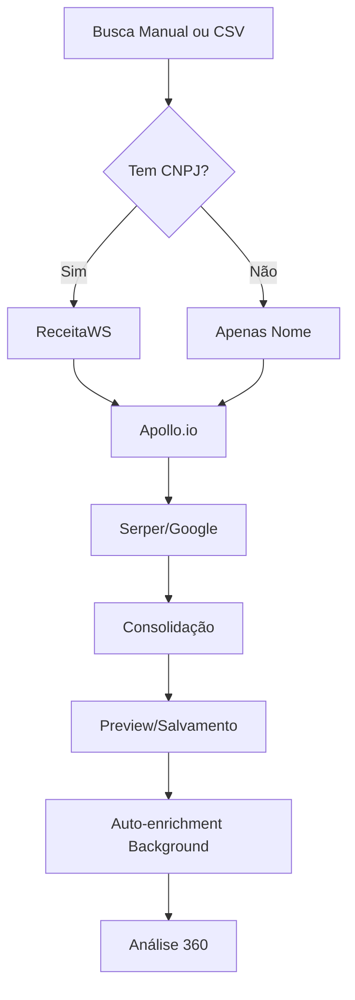

# 🔍 Sistema de Busca Completo - Estado Atual

## ✅ O QUE ESTÁ FUNCIONANDO

### 1. Interface de Busca Consolidada (`/search`)

A página de busca está **COMPLETA** com todos os campos solicitados:

#### Busca Principal
- **CNPJ** (opcional) - com validação e formatação automática
- **Nome da Empresa** (opcional) - busca por nome com autocomplete Google

#### Campos de Refinamento - Presença Digital
- **Website** - URL completa (ex: `https://exemplo.com.br`)
- **Instagram** - @usuario ou URL completa
- **LinkedIn** - URL da página company

#### Campos de Refinamento - Produtos & Segmentação
- **Produto/Categoria** - texto livre (ex: "ERP", "CRM", "Software")
- **Marca** - nome da marca
- **Link Produto/Marketplace** - URL de marketplace (Mercado Livre, Alibaba, etc.)

#### Campos de Refinamento - Localização
- **CEP** - com autopreenchimento via ViaCEP
- **Estado** - dropdown com todos os estados brasileiros
- **País** - padrão "Brasil"
- **Município** - com autocomplete Google Places
- **Bairro** - com autocomplete Google Places
- **Logradouro** - com autocomplete Google Places
- **Número** - número do estabelecimento

### 2. Upload CSV em Massa

#### Template CSV
O template de download inclui **TODOS os campos**:
```csv
CNPJ,Nome da Empresa,Website,Instagram,LinkedIn,Produto/Categoria,Marca,Link Produto/Marketplace,CEP,Estado,Pais,Municipio,Bairro,Logradouro,Numero
```

#### Parser Robusto ✅ CORRIGIDO
- **UTF-8 BOM** para compatibilidade com Excel
- **Parser que lida com vírgulas dentro de valores** (usando aspas)
- **Validação campo a campo** com mensagens de erro detalhadas
- **Detecção automática** de cabeçalhos
- **Limite de 500 empresas** por upload

#### Processamento
- Salva todos os campos no banco de dados
- Dispara **auto-enrichment em background** para cada empresa
- Retorna relatório de sucesso/erros detalhado

### 3. Edge Functions

#### `search-companies` (Busca Única)
**Entrada:** Todos os campos (CNPJ, nome, refinamentos)

**Processamento:**
1. ReceitaWS (se CNPJ fornecido)
2. Apollo.io (busca por nome e domínio)
3. Google Serper (análise de maturidade digital)
4. Decisores (Apollo People Search)

**Saída:**
- Dados da empresa consolidados
- Lista de decisores
- Score de maturidade digital
- **Todos os refinamentos salvos** em `raw_data`

#### `search-companies-multiple` (Busca Múltipla)
**Entrada:** Query (nome da empresa)

**Processamento:**
1. Google Custom Search (até 10 resultados)
2. Apollo.io Organizations (até 15 resultados)
3. Deduplicação por domínio e nome
4. Ordenação por relevância

**Saída:** Lista de empresas candidatas para seleção

#### `bulk-upload-companies` (Upload CSV)
**Entrada:** Array de empresas do CSV

**Processamento:**
1. Validação de cada linha
2. Limpeza e formatação de dados
3. Upsert no banco (por CNPJ se existir)
4. Disparo de auto-enrichment assíncrono

**Saída:** Relatório de sucessos e erros

### 4. Fluxo de Dados



## ⚠️ O QUE ESTÁ PARCIALMENTE IMPLEMENTADO

### 1. Uso de Refinamentos na Busca
**Status:** Campos são **salvos** mas **não usados ativamente** para refinar busca

**Atualmente:**
- Campos de produto/marca/marketplace são salvos em `raw_data`
- Instagram é salvo mas não usado para scraping
- Localização é salva mas não usada para filtrar resultados

**Deveria:**
- Usar produto/marca para refinar busca no Google
- Buscar Instagram da empresa e analisar presença
- Filtrar resultados do Apollo por localização
- Usar marketplace links para análise de e-commerce

### 2. Busca Múltipla com Refinamentos
**Status:** `search-companies-multiple` só aceita `query`

**Deveria:**
- Aceitar todos os campos de refinamento
- Usar localização para filtrar Google/Apollo
- Usar produto/marca para query refinada
- Pontuar resultados baseado em match de refinamentos

## ❌ O QUE AINDA NÃO ESTÁ IMPLEMENTADO

### 1. Análise 360 Consolidada
**Necessário:**
- Engine que consolida TODAS as fontes:
  - ReceitaWS (dados oficiais)
  - Apollo.io (dados corporativos, decisores, tech stack)
  - Google/Serper (presença digital, notícias)
  - LinkedIn (scraping de empresa e funcionários)
  - Instagram (análise de engajamento)
  - Marketplaces (presença e-commerce)
  - JusBrasil (processos legais)
  - Serasa/SCPC (dados financeiros)
  - Reclame Aqui (reputação)

### 2. RAG (Retrieval-Augmented Generation)
**Necessário:**
- Vector database (Supabase pgvector)
- Embeddings de dados de empresas
- Sistema de query semântico
- Cache de análises anteriores

### 3. Insights & Predição
**Necessário:**
- Engine de padrões (pattern matching)
- Scoring preditivo (churn risk, fit score)
- Recomendações contextuais
- Alertas proativos

### 4. Scraping Avançado
**Necessário:**
- PhantomBuster LinkedIn (já configurado mas não integrado)
- Instagram scraping (engajamento, posts recentes)
- Análise de tech stack via BuiltWith/Wappalyzer
- Monitoramento de mudanças (job postings, funding)

## 🎯 PRÓXIMOS PASSOS RECOMENDADOS

### Fase 1: Refinamento de Busca (Alta Prioridade)
1. ✅ **Corrigir CSV parser** (FEITO)
2. **Integrar refinamentos na busca:**
   - Usar produto/marca/marketplace na query Google
   - Filtrar Apollo por localização
   - Buscar Instagram automaticamente
3. **Melhorar busca múltipla:**
   - Aceitar todos os campos de refinamento
   - Pontuar por match de critérios

### Fase 2: Análise 360 (Média Prioridade)
1. **Criar engine de consolidação:**
   - Orquestrar todas as fontes de dados
   - Resolver conflitos entre fontes
   - Calcular scores consolidados
2. **Integrar PhantomBuster:**
   - LinkedIn company scraping
   - LinkedIn people scraping
3. **Adicionar análise de reputação:**
   - Reclame Aqui scraping
   - Trustpilot/Google Reviews

### Fase 3: Inteligência (Baixa Prioridade)
1. **Implementar RAG:**
   - Configurar pgvector
   - Gerar embeddings
   - Sistema de chat contextual
2. **Engine de insights:**
   - Padrões e anomalias
   - Predição de fit/churn
   - Recomendações automatizadas

## 📊 TESTE COM 20 EMPRESAS REAIS

Para testar a coerência e qualidade dos dados, recomendo:

### Método 1: Upload CSV
1. Baixar template na página `/search`
2. Preencher com as 20 empresas (máximo de campos possível)
3. Upload via botão "Upload em Massa"
4. Aguardar processamento (1-2 min)
5. Verificar na página `/companies` os resultados

### Método 2: Busca Individual
1. Para cada empresa:
   - Buscar por CNPJ se disponível
   - Adicionar refinamentos (website, LinkedIn, localização)
   - Revisar preview antes de salvar
2. Comparar qualidade dos dados

### Métricas de Qualidade
- **Cobertura:** % de campos preenchidos
- **Precisão:** Dados corretos vs incorretos
- **Decisores:** Quantidade e qualidade
- **Maturidade:** Score faz sentido?
- **Tempo:** Quanto tempo leva?

## 🔧 CONFIGURAÇÃO ATUAL

### APIs Ativas
- ✅ ReceitaWS (CNPJ oficial)
- ✅ Apollo.io (dados corporativos)
- ✅ Google Custom Search (busca web)
- ✅ Google Places (autocomplete endereços)
- ✅ Serper (análise digital)
- ✅ ViaCEP (busca CEP)
- ⚠️ PhantomBuster (configurado mas não integrado)
- ❌ Instagram API (não implementado)
- ❌ JusBrasil (não implementado)
- ❌ Serasa/SCPC (não implementado)

### Limitações Conhecidas
- Instagram: apenas salva link, não scrape
- LinkedIn: apenas salva link (PhantomBuster disponível)
- Marketplace: apenas salva link, não analisa
- Localização: não filtra resultados Apollo/Google
- Produto/Marca: não refina busca

## 📝 COMO USAR AGORA

### Para Buscar Uma Empresa
1. Acesse `/search`
2. Preencha **pelo menos um campo** (CNPJ recomendado)
3. Adicione refinamentos para melhor resultado
4. Clique "Buscar"
5. Revise o preview
6. Confirme para salvar

### Para Upload em Massa
1. Acesse `/search`
2. Clique "Upload em Massa"
3. Baixe o template
4. Preencha com suas empresas
5. Faça upload
6. Aguarde processamento
7. Veja resultados em `/companies`

### Para Ver Análise Completa
1. Acesse `/companies`
2. Clique em uma empresa
3. Veja análise 360 (limitada às fontes ativas)
4. Use aba "Intelligence 360" para mais insights
